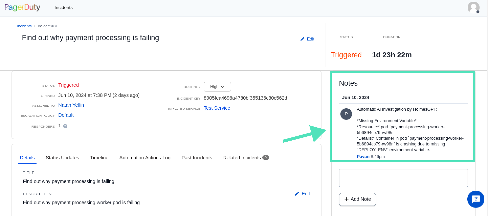
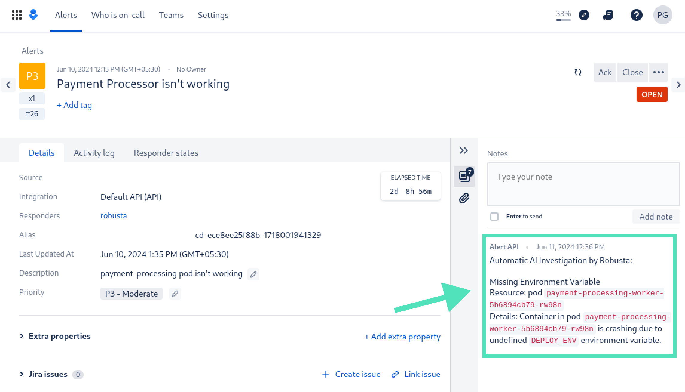

<div align="center">
  <h1 align="center">Get a head start on fixing alerts with AI investigation</h1>
  <h2 align="center">HolmesGPT - The Open Source AIOps Platform</h2>
  <p align="center">
    <a href="#built-in-integrations"><strong>Integrations</strong></a> |
    <a href="#benefits"><strong>Benefits</strong></a> |
    <a href="#installation"><strong>Installation</strong></a> |
    <a href="https://www.youtube.com/watch?v=TfQfx65LsDQ"><strong>YouTube Demo</strong></a>
  </p>
</div>

Increase your cloud uptime and reliability by feeding live observability data into AI models, and using them to proactively spot problems and investigate alerts.

**By feeding live data into LLMs, HolmesGPT achieves high-accuracy without hallucinations.** It supports strict compliance requirements and can use private AI models in your own cloud.

HolmesGPT is the only AI agent that can reduce your mean time to response (MTTR) with actionable insights. Make every engineer an expert by giving them an AIOps copilot, customized for your cloud.


## Quick Start

**Prerequisite:** <a href="#getting-an-api-key"> Get an API key for a supported LLM.</a>

<details>
<summary>
Investigate a Prometheus alert with AI
</summary>

Install HolmesGPT with brew (<a href="#installation">see alternatives</a>):

```
brew tap robusta-dev/homebrew-holmesgpt
brew install holmesgpt
```

Point holmes at AlertManager, give it an API Key, and start investigating:

```
# optional - port-forward alertmanager if it is running in a k8s cluster
# kubectl port-forward alertmanager-robusta-kube-prometheus-st-alertmanager-0 9093:9093 &

# run holmes
holmes investigate alertmanager --alertmanager-url http://localhost:9093 --api-key=<openai-api-key>
```

Example output:

```
TODO
```

If you are happy with the results, you enable this for all Prometheus alerts in Slack:


👆 To set up, [install the official Holmes+Robusta integration and follow this guide.](https://docs.robusta.dev/holmes_chart_dependency/configuration/ai-analysis.html)

</details>

<details>
<summary>Root Cause Analysis for PagerDuty/OpsGenie/Jira (and more)</summary>

**PagerDuty:**
```bash
holmes investigate pagerduty --pagerduty-api-key <PLACEHOLDER_APIKEY>
```



By default results are displayed in the CLI. Use `--update --pagerduty-user-email <PLACEHOLDER_EMAIL>` to get the results as a comment in the PagerDuty issue. Refer to the CLI help for more info. 

**OpsGenie:**
```bash
holmes investigate opsgenie --opsgenie-api-key <PLACEHOLDER_APIKEY>
```



By default results are displayed in the CLI . Use `--update --opsgenie-team-integration-key <PLACEHOLDER_TEAM_KEY>` to get the results as a comment in the OpsGenie alerts. Refer to the CLI help for more info. 

**Jira:**

```bash
holmes investigate jira --jira-url https://<PLACEDHOLDER>.atlassian.net --jira-username <PLACEHOLDER_EMAIL> --jira-api-key <PLACEHOLDER_API_KEY>
```

TODO: image

**GitHub:**

```bash
holmes investigate github --github-url https://<PLACEHOLDER> --github-owner <PLACEHOLDER_OWNER_NAME> --github-repository <PLACEHOLDER_GITHUB_REPOSITORY> --github-pat <PLACEHOLDER_GITHUB_PAT>
```

</details>

<details>
<summary>Check application rollouts for problems</summary>

Reduce the risk of application updates by running a scan 5 minutes after a deploy.

This is typically setup with CI/CD, but lets start with a local example:

```bash
# TODO: deploy a new software version
holmes ask "I just deployed the .... Is it healthy? Are there any degredations compared to the previous version? Check XYZ"
```

You can send results to a Slack channel:

```bash
TODO
```

This can be run from CI/CD on every deploy. For example, in GitHub actions:
```bash
TODO
```
</details>

<details>
<summary>Track ArgoCD updates and proactively spot degredations</summary>
</details>

<details>
<summary>Scan your cluster for unknown problems</summary>
</details>

<details>
<summary>More use cases</summary>

**Analyze errors in a log file (and automatically run commands to investigate errors in the log):**
```console
sudo dmesg > dmesg.log
poetry run python3 holmes.py ask "investigate errors in this dmesg log" -f dmesg.log
```

**Ask Questions About Your Cloud:**

```bash
holmes ask "what services does my cluster expose externally?"
```

**Find the right configuration to change in big Helm charts:**

LLM uses the built-in [Helm toolset](./holmes/plugins/toolsets/helm.yaml) to gather information.

```bash
holmes ask "what helm value should I change to increase memory request of the my-argo-cd-argocd-server-6864949974-lzp6m pod"
```

**Optimize Docker container size:***

LLM uses the built-in [Docker toolset](./holmes/plugins/toolsets/docker.yaml) to gather information.

```bash
holmes ask "Tell me what layers of my pavangudiwada/robusta-ai docker image consume the most storage and suggest some fixes to it"
```
</details>

## Installation

**Prerequisite:** <a href="#getting-an-api-key"> Get an API key for a supported LLM.</a>

**Installation Methods:**

<details>
  <summary>Brew (Mac/Linux)</summary>

1. Add our tap:

```sh
brew tap robusta-dev/homebrew-holmesgpt
```

2. Install holmesgpt:

```sh
brew install holmesgpt
```

3. Check that installation was successful. **This will take a few seconds on the first run - wait patiently.**:

```sh
holmes --help
```

4. Run holmesgpt:

```sh
holmes ask "what issues do I have in my cluster"
```

See <a href="#quick-start">Quick Start</a> for next steps.

</details>

<details>
<summary>Docker Container</summary>

**Image:** `docker.pkg.dev/genuine-flight-317411/devel/holmes-dev`

**Tip:** mount config files so that HolmesGPT can read data from your Kubernetes cluster (or other cloud resources):

```bash
docker run -it --net=host -v ~/.holmes:/root/.holmes -v ~/.aws:/root/.aws -v ~/.config/gcloud:/root/.config/gcloud -v $HOME/.kube/config:/root/.kube/config us-central1-docker.pkg.dev/genuine-flight-317411/devel/holmes-dev ask "what pods are unhealthy and why?"
```

See <a href="#quick-start">Quick Start</a> for next steps.
</details>

<details>

<summary>Cutting Edge (Pip and Pipx)</summary>

You can install HolmesGPT from the latest git version with pip or pipx.

We recommend using pipx because it guarantees that HolmesGPT is isolated from other python packages on your system, preventing dependency conflicts.

First [Pipx](https://github.com/pypa/pipx) (skip this step if you are using pip).

Then install HolmesGPT from git with either pip or pipx:

```
pipx install "https://github.com/robusta-dev/holmesgpt/archive/refs/heads/master.zip"
```

Verify that HolmesGPT was installed by checking the version:

```
holmes version
```

To upgrade HolmesGPT with pipx, you can run:

```
pipx upgrade holmesgpt
```

See <a href="#quick-start">Quick Start</a> for next steps.
</details>

<details>

<summary>From Source (Python Poetry)</summary>

First [install poetry (the python package manager)](https://python-poetry.org/docs/#installing-with-the-official-installer)

```
git clone https://github.com/robusta-dev/holmesgpt.git
cd holmesgpt
poetry install --no-root
poetry run python3 holmes.py ask "what pods are unhealthy and why?"
```

See <a href="#quick-start">Quick Start</a> for next steps.
</details>

<details>
<summary>From Source (Docker)</summary>

Clone the project from github, and then run:

```bash
cd holmesgpt
docker build -t holmes . -f Dockerfile.dev
docker run -it --net=host -v -v ~/.holmes:/root/.holmes -v ~/.aws:/root/.aws -v ~/.config/gcloud:/root/.config/gcloud -v $HOME/.kube/config:/root/.kube/config holmes ask "what pods are unhealthy and why?"
```

See <a href="#quick-start">Quick Start</a> for next steps.
</details>

<details>
<summary>Run HolmesGPT in your cluster (Helm)</summary>

Most users should install Holmes using the instructions in the [Robusta docs ↗](https://docs.robusta.dev/master/configuration/ai-analysis.html) and NOT the below instructions. 

By using the ``Robusta`` integration you’ll benefit from an end-to-end integration that integrates with ``Prometheus alerts`` and ``Slack``. Using the below instructions you’ll have to build many of those components yourself.

In this mode, all the parameters should be passed to the HolmesGPT deployment, using environment variables.

We recommend pulling sensitive variables from Kubernetes ``secrets``.

First, you'll need to create your ``holmes-values.yaml`` file, for example:
 
    additionalEnvVars:
    - name: MODEL
      value: gpt-4o
    - name: OPENAI_API_KEY
      value: <your open ai key>


Then, install with ``helm``;

    helm repo add robusta https://robusta-charts.storage.googleapis.com && helm repo update
    helm install holmes robusta/holmes -f holmes-values.yaml


For all LLMs you need to provide the ``MODEL`` environment variable, which specifies which model you are using.

Some LLMs requires additional variables:

<details>
<summary>OpenAI</summary>

For OpenAI, only the ``model`` and ``api-key`` should be provided

    additionalEnvVars:
    - name: MODEL
      value: gpt-4o
    - name: OPENAI_API_KEY
      valueFrom:
        secretKeyRef:
          name: my-holmes-secret
          key: openAiKey

**Note**: ``gpt-4o`` is optional since it's default model. 

</details>

<details>
<summary>Azure OpenAI</summary>

To work with Azure AI, you need to provide the below variables:

    additionalEnvVars:
    - name: MODEL
      value: azure/my-azure-deployment         # your azure deployment name
    - name: AZURE_API_VERSION
      value: 2024-02-15-preview                # azure openai api version
    - name: AZURE_API_BASE
      value: https://my-org.openai.azure.com/  # base azure openai url
    - name: AZURE_API_KEY
      valueFrom:
        secretKeyRef:
          name: my-holmes-secret
          key: azureOpenAiKey

</details>

<details>
<summary>AWS Bedrock</summary>
    
    enablePostProcessing: true
    additionalEnvVars:
    - name: MODEL
      value: bedrock/anthropic.claude-3-5-sonnet-20240620-v1:0 
    - name: AWS_REGION_NAME
      value: us-east-1
    - name: AWS_ACCESS_KEY_ID
      valueFrom:
        secretKeyRef:
          name: my-holmes-secret
          key: awsAccessKeyId
    - name: AWS_SECRET_ACCESS_KEY
      valueFrom:
        secretKeyRef:
          name: my-holmes-secret
          key: awsSecretAccessKey

**Note**: ``bedrock claude`` provides better results when using post-processing to summarize the results.
</details>


</details>

### Getting an API Key

HolmesGPT requires an LLM API Key to function. The most common option is OpenAI, but many [LiteLLM-compatible](https://docs.litellm.ai/docs/providers/) models are supported. The LLM is configured with:

* `--model` cli flag - e.g. `gpt-4o` or `bedrock/anthropic.claude-3-5-sonnet-20240620-v1:0`
* `--api-key` cli flag - optional, not required by all providers
* Provider-specific environment variables

**Instructions for popular LLMs:**

<details>
<summary>OpenAI</summary>
  
To work with OpenAI’s GPT 3.5 or GPT-4 models you need a paid [OpenAI API key](https://help.openai.com/en/articles/4936850-where-do-i-find-my-openai-api-key).

**Note**: This is different from being a “ChatGPT Plus” subscriber.

Pass your API key to holmes with the `--api-key` cli argument. Because OpenAI is the default LLM, the `--model` flag is optional for OpenAI (gpt-4o is the default).

```
holmes ask --api-key="..." "what pods are crashing in my cluster and why?"
```

If you prefer not to pass secrets on the cli, set the OPENAI_API_KEY environment variable or save the API key in a HolmesGPT config file.

</details>

<details>
<summary>Azure OpenAI</summary>

To work with Azure AI, you need an [Azure OpenAI resource](https://learn.microsoft.com/en-us/azure/ai-services/openai/how-to/create-resource?pivots=web-portal#create-a-resource) and to set the following environment variables:

* AZURE_API_VERSION - e.g. 2024-02-15-preview
* AZURE_API_BASE - e.g. https://my-org.openai.azure.com/
* AZURE_API_KEY (optional) - equivalent to the `--api-key` cli argument

Set those environment variables and run:

```bash
holmes ask "what pods are unhealthy and why?" --model=azure/<DEPLOYMENT_NAME> --api-key=<API_KEY>
```

Refer [LiteLLM Azure docs ↗](https://litellm.vercel.app/docs/providers/azure) for more details. 
</details>

<details>
<summary>AWS Bedrock</summary>

Before running the below command you must run `pip install boto3>=1.28.57` and set the following environment variables:

* `AWS_REGION_NAME`
* `AWS_ACCESS_KEY_ID`
* `AWS_SECRET_ACCESS_KEY`

If the AWS cli is already configured on your machine, you may be able to find those parameters with:

```console
cat ~/.aws/credentials ~/.aws/config
```

Once everything is configured, run:
```console
holmes ask "what pods are unhealthy and why?" --model=bedrock/<MODEL_NAME>
```

Be sure to replace `MODEL_NAME` with a model you have access to - e.g. `anthropic.claude-3-5-sonnet-20240620-v1:0`. To list models your account can access:

```
aws bedrock list-foundation-models --region=us-east-1
```

Note that different models are available in different regions. For example, Claude Opus is only available in us-west-2.

Refer to [LiteLLM Bedrock docs ↗](https://litellm.vercel.app/docs/providers/bedrock) for more details. 
</details>

<details>
<summary>Using a self-hosted LLM</summary>

You will need an LLM with support for function-calling (tool-calling). To use it, set the OPENAI_BASE_URL environment variable and run `holmes` with a relevant model name set using `--model`.

**Important: Please verify that your model and inference server support function calling! HolmesGPT is currently unable to check if the LLM it was given supports function-calling or not. Some models that lack function-calling capabilities will  hallucinate answers instead of reporting that they are unable to call functions. This behaviour depends on the model.**

In particular, note that [vLLM does not yet support function calling](https://github.com/vllm-project/vllm/issues/1869), whereas [llama-cpp does support it](https://github.com/abetlen/llama-cpp-python?tab=readme-ov-file#function-calling).

</details>


## Advanced Features
<details>
<summary>Connect HolmesGPT to your existing observability data</summary>
TODO - needs more work

The more data you give HolmesGPT, the better it will perform. Give it access to more data by adding custom tools.

New tools are loaded using `-t` from [custom toolset files](./examples/custom_toolset.yaml) or by adding them to the `~/.holmes/config.yaml` with the setting `custom_toolsets: ["/path/to/toolset.yaml"]`.


You can define your own custom toolsets to extend the functionality of your setup. These toolsets can include querying company-specific data, fetching logs from observability tools, and more.

```bash
# Add paths to your custom toolsets here
# Example: ["path/to/your/custom_toolset.yaml"]
#custom_toolsets: ["examples/custom_toolset.yaml"]
```

</details>

<details>
<summary>Customize investigations for your needs</summary>
HolmesGPT can investigate by following runbooks written in plain English. Add your own runbooks to provided the LLM specific instructions.

New runbooks are loaded using `-r` from [custom runbook files](./examples/custom_runbook.yaml) or by adding them to the `~/.holmes/config.yaml` with the `custom_runbooks: ["/path/to/runbook.yaml"]`.
</details>

<details>
<summary>View data used by HolmesGPT to make decisions (data transparency)</summary>
</details>

<details>
<summary>Bi-directional integrations with Slack/Jira/PagerDuty/etc</summary>
</details>

<details>
<summary>Save common settings in a config file</summary>

You can save common cli flags in a config file to avoid specifying them every time.

[Example config file with all available settings](config.example.yaml).

By default, HolmesGPT will try to read `~/.holmes/config.yaml`. You can override with the `--config` flag.

If settings are present in both config file and cli, the cli option takes precedence.


## Integration Instructions

Detailed instructions for common integrations:

<summary>Alertmanager</summary>

TODO

</details>

<details>

<summary>Jira</summary>

TODO

Integrate with Jira to automate issue tracking and project management tasks. Provide your Jira credentials and specify the query to fetch issues and optionally update their status.

```bash
# Jira credentials and query settings
#jira_username: "user@company.com"
#jira_api_key: "..."
#jira_url: "https://your-company.atlassian.net"
#jira_query: "project = 'Natan Test Project' and Status = 'To Do'"
```

1. **jira_username**: The email you use to log into your Jira account. Eg: `jira-user@company.com`
2. **jira_api_key**: Follow these [instructions](https://support.atlassian.com/atlassian-account/docs/manage-api-tokens-for-your-atlassian-account/) to get your API key.
3. **jira_url**: The URL of your workspace. For example: [https://workspace.atlassian.net](https://workspace.atlassian.net) (**Note:** schema (https) is required)
4. **project**: Name of the project you want the Jira tickets to be created in. Go to **Project Settings** -> **Details** -> **Name**.
5. **jira_query**: See example above
</details>

<details>

<summary>GitHub</summary>

TODO 
Integrate with GitHub to automate issue tracking and project management tasks. Provide your GitHub PAT (*personal access token*) and specify the `owner/repository`.

```bash
# GitHub credentials and query settings
#github_owner: "robusta-dev"
#github_pat: "..."
#github_url: "https://api.github.com" (default)
#github_repository: "holmesgpt"
#github_query: "is:issue is:open"
```

1. **github_owner**: The repository owner. Eg: `robusta-dev`
2. **github_pat**: Follow these [instructions](https://docs.github.com/en/authentication/keeping-your-account-and-data-secure/managing-your-personal-access-tokens#creating-a-fine-grained-personal-access-token) to get your GitHub pat (*personal access token*).
3. **github_url**: The URL of your GitHub API. For example: [https://api.github.com](https://api.github.com) (**Note:** schema (https) is required)
4. **github_repository**: Name of the repository you want the GitHub issues to be scanned. Eg: `holmesgpt`.
</details>

<details>
<summary>PagerDuty</summary>

Integrate with PagerDuty to automate incident tracking and project management tasks. Provide your PagerDuty credentials and specify the user email to update the incident with findings.

```bash
pagerduty_api_key: "..."
pagerduty_user_email: "user@mail.com"
pagerduty_incident_key:  "..."
```

1. **pagerduty_api_key**: The PagerDuty API key.  This can be found in the PagerDuty UI under Integrations > API Access Key.
2. **pagerduty_user_email**: When --update is set, which user will be listed as the user who updated the incident. (Must be the email of a valid user in your PagerDuty account.)
3. **pagerduty_incident_key**: If provided, only analyze a single PagerDuty incident matching this key
</details>

<details>
<summary>OpsGenie</summary>

Integrate with OpsGenie to automate alert investigations. Provide your OpsGenie credentials and specify the query to fetch alerts.

```bash
opsgenie_api_key : "..."
opsgenie-team-integration-key: "...."
opsgenie-query: "..."
```

1. **opsgenie_api_key**: The OpsGenie API key. Get it from Settings > API key management > Add new API key
2. **opsgenie-team-integration-key**: OpsGenie Team Integration key for writing back results. (NOT a normal API Key.) Get it from Teams > YourTeamName > Integrations > Add Integration > API Key. Don't forget to turn on the integration and add the Team as Responders to the alert.
3. **opsgenie-query**: E.g. 'message: Foo' (see https://support.atlassian.com/opsgenie/docs/search-queries-for-alerts/) 
</details>


<details>

<summary>Slack</summary>

Configure Slack to send notifications to specific channels. Provide your Slack token and the desired channel for notifications.

```bash
# Slack token and channel configuration
#slack_token: "..."
#slack_channel: "#general"
```

1. **slack-token**: The Slack API key. You can generate with `pip install robusta-cli && robusta integrations slack`
2. **slack-channel**: The Slack channel where you want to receive the findings.

</details>


## License

Distributed under the MIT License. See [LICENSE.txt](https://github.com/robusta-dev/holmesgpt/blob/master/LICENSE.txt) for more information.
<!-- Change License -->

## Support

If you have any questions, feel free to message us on [robustacommunity.slack.com](https://bit.ly/robusta-slack)

## How to Contribute

To contribute to HolmesGPT, first follow the <a href="#installation"><strong>Installation</strong></a> instructions for **running HolmesGPT from source using Poetry.** Then follow an appropriate guide below, or ask us for help on [Slack](https://bit.ly/robusta-slack)

<details>
<summary>Adding new runbooks</summary>

You can contribute knowledge on solving common alerts and HolmesGPT will use this knowledge to solve related issues. To do so, add a new file to [./holmes/plugins/runbooks](holmes/plugins/runbooks) - or edit an existing runbooks file in that same directory. 

Note: if you prefer to keep your runbooks private, you can store them locally and pass them to HolmesGPT with the `-r` flag. However, if your runbooks relate to common problems that others may encounter, please consider opening a PR and making HolmesGPT better for everyone!

</details>

<details>
<summary>Adding new toolsets</summary>

You can add define new tools in YAML and HolmesGPT will use those tools in it's investigation. To do so, add a new file to [./holmes/plugins/toolsets](holmes/plugins/toolsets) - or edit an existing toolsets file in that same directory. 

Note: if you prefer to keep your tools private, you can store them locally and pass them to HolmesGPT with the `-t` flag. However, please consider contributing your toolsets! At least one other community member will probably find them useful!

</details>

<details>
<summary>Modifying the default prompts (prompt engineering)</summary>

The default prompts for HolmesGPT are located in [./holmes/plugins/prompts](holmes/plugins/prompts). Most `holmes` commands accept a `--system-prompt` flag that you can use to override this.

If you find a scenario where the default prompts don't work, please consider letting us know by opening a GitHub issue or messaging us on Slack! We have an internal evaluation framework for benchmarking prompts on many troubleshooting scenarios and if you share a case where HolmesGPT doesn't work, we will be able to add it to our test framework and fix the performance on that issue and similar ones.

</details>

<details>
<summary>Adding new data sources</summary>

If you want HolmesGPT to investigate external tickets or alert, you can add a new datasource. This requires modifying the source code and opening a PR. [You can see an example PR like that here, which added support for investigating GitHub issues](https://github.com/robusta-dev/holmesgpt/pull/28/files).

</details>
