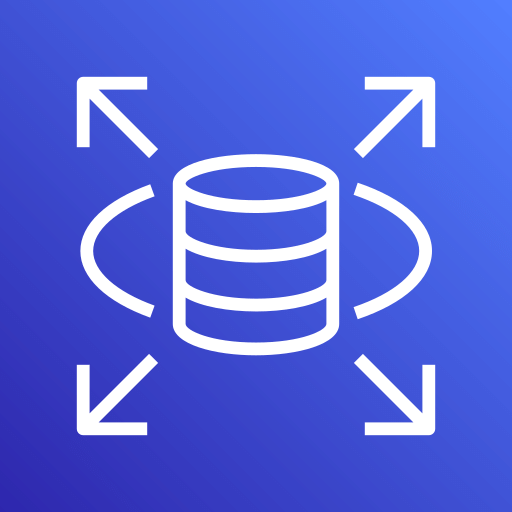
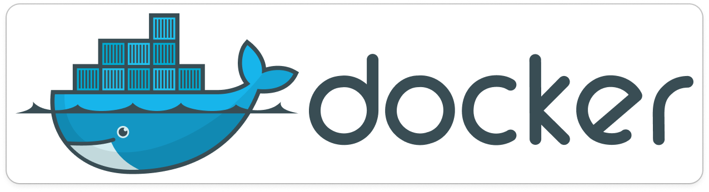
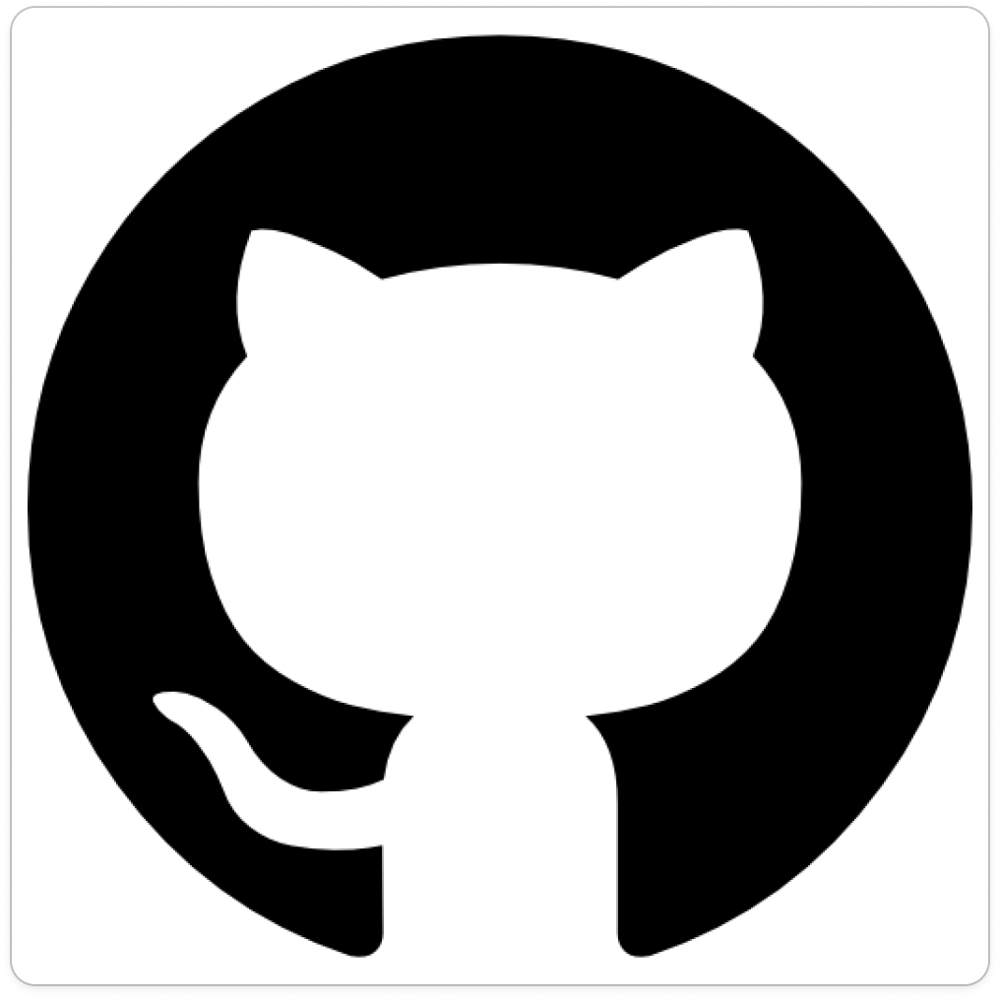
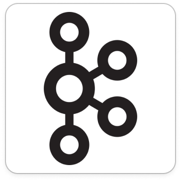
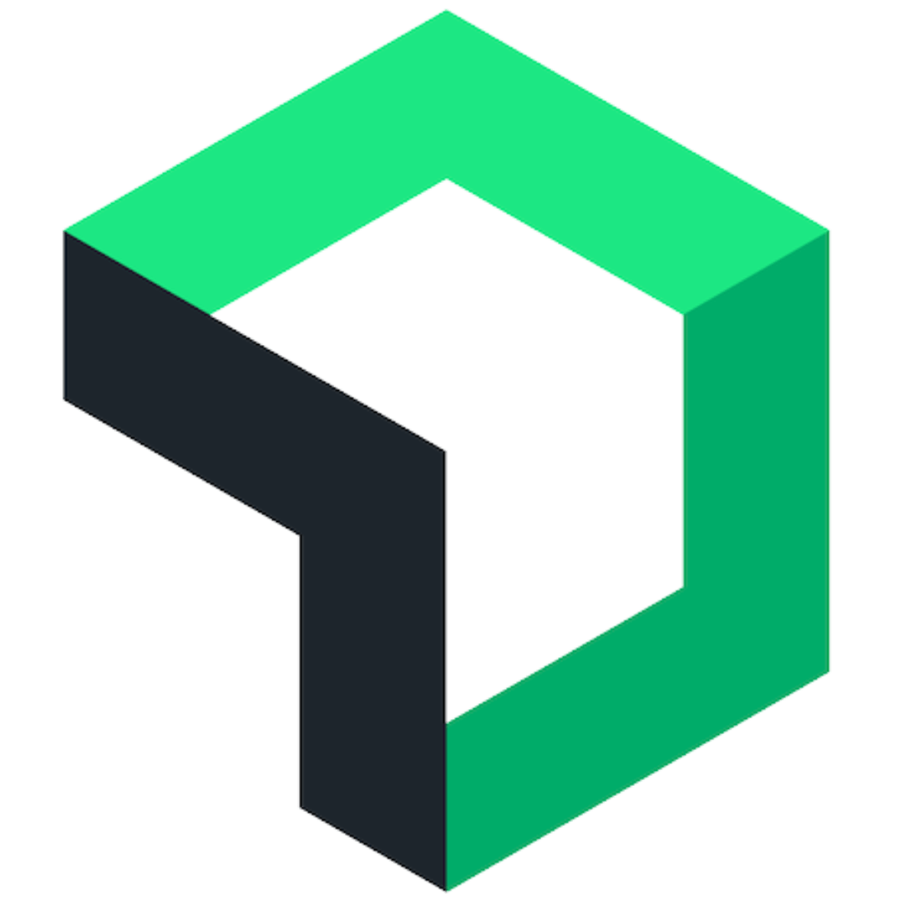
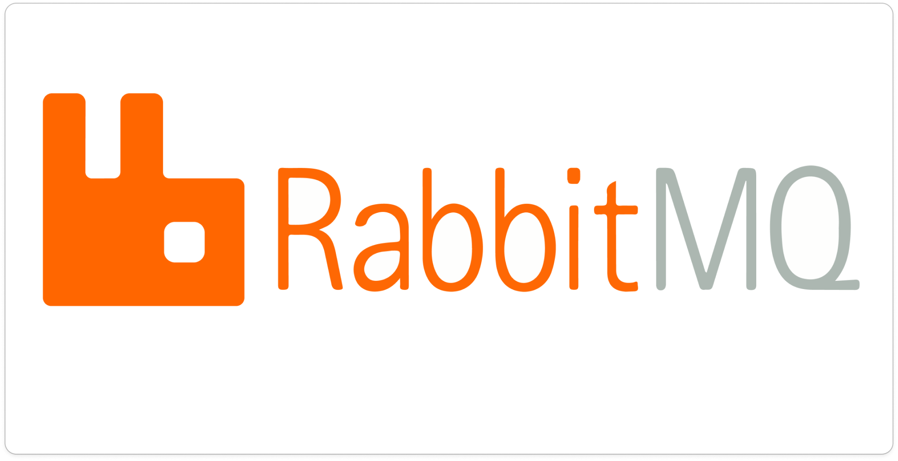
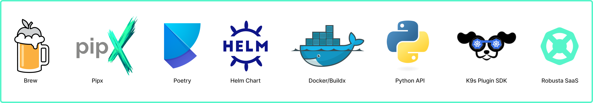
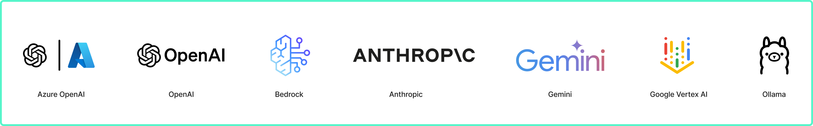

<div align="center">
  <h1 align="center">AI Agent for Cloud Troubleshooting and Alert Investigation</h1>

HolmesGPT is an AI agent for investigating problems in your cloud, finding the root cause, and suggesting remediations. It has dozens of built-in integrations for cloud providers, observability tools, and on-call systems.

HolmesGPT has been submitted to the CNCF as a sandbox project ([view status](https://github.com/cncf/sandbox/issues/392)). You can learn more about HolmesGPT's maintainers and adopters [here](./ADOPTERS.md).

  <p align="center">
    <a href="#how-it-works"><strong>How it Works</strong></a> |
    <a href="#installation"><strong>Installation</strong></a> |
    <a href="#supported-llm-providers"><strong>LLM Providers</strong></a> |
    <a href="https://www.youtube.com/watch?v=TfQfx65LsDQ"><strong>YouTube Demo</strong></a> |
    <a href="https://deepwiki.com/robusta-dev/holmesgpt"></a>
  </p>
</div>


## How it Works

HolmesGPT connects AI models with live observability data and organizational knowledge. It uses an **agentic loop** to analyze data from multiple sources and identify possible root causes.


### 🔗 Data Sources

HolmesGPT integrates with popular observability and cloud platforms. The following data sources ("toolsets") are built-in. [Add your own](#customizing-holmesgpt).

| Data Source | Status | Notes |
|-------------|--------|-------|
| [ **ArgoCD**](https://robusta-dev.github.io/holmesgpt/data-sources/builtin-toolsets/argocd/) | ✅ | Get status, history and manifests and more of apps, projects and clusters |
| [ **AWS RDS**](https://robusta-dev.github.io/holmesgpt/data-sources/builtin-toolsets/aws/) | ✅ | Fetch events, instances, slow query logs and more |
| [ **Confluence**](https://robusta-dev.github.io/holmesgpt/data-sources/builtin-toolsets/confluence/) | ✅ | Private runbooks and documentation |
| [ **Coralogix Logs**](https://robusta-dev.github.io/holmesgpt/data-sources/builtin-toolsets/coralogix-logs/) | ✅ | Retrieve logs for any resource |
| [ **Datetime**](https://robusta-dev.github.io/holmesgpt/data-sources/builtin-toolsets/datetime/) | ✅ | Date and time-related operations |
| [ **Docker**](https://robusta-dev.github.io/holmesgpt/data-sources/builtin-toolsets/docker/) | ✅ | Get images, logs, events, history and more |
| [ **GitHub**](https://robusta-dev.github.io/holmesgpt/data-sources/builtin-toolsets/github/) | 🟡 Beta | Remediate alerts by opening pull requests with fixes |
| [ **DataDog**](https://robusta-dev.github.io/holmesgpt/data-sources/builtin-toolsets/datadog/) | 🟡 Beta | Fetches log data from datadog  |
| [ **Grafana Loki**](https://robusta-dev.github.io/holmesgpt/data-sources/builtin-toolsets/grafanaloki/) | ✅ | Query logs for Kubernetes resources or any query |
| [ **Grafana Tempo**](https://robusta-dev.github.io/holmesgpt/data-sources/builtin-toolsets/grafanatempo/) | ✅ | Fetch trace info, debug issues like high latency in application. |
| [ **Helm**](https://robusta-dev.github.io/holmesgpt/data-sources/builtin-toolsets/helm/) | ✅ | Release status, chart metadata, and values |
| [ **Internet**](https://robusta-dev.github.io/holmesgpt/data-sources/builtin-toolsets/internet/) | ✅ | Public runbooks, community docs etc |
| [ **Kafka**](https://robusta-dev.github.io/holmesgpt/data-sources/builtin-toolsets/kafka/) | ✅ | Fetch metadata, list consumers and topics or find lagging consumer groups |
| [ **Kubernetes**](https://robusta-dev.github.io/holmesgpt/data-sources/builtin-toolsets/kubernetes/) | ✅ | Pod logs, K8s events, and resource status (kubectl describe) |
| [ **NewRelic**](https://robusta-dev.github.io/holmesgpt/data-sources/builtin-toolsets/newrelic/) | 🟡 Beta | Investigate alerts, query tracing data |
| [ **OpenSearch**](https://robusta-dev.github.io/holmesgpt/data-sources/builtin-toolsets/opensearch-status/) | ✅ | Query health, shard, and settings related info of one or more clusters|
| [ **Prometheus**](https://robusta-dev.github.io/holmesgpt/data-sources/builtin-toolsets/prometheus/) | ✅ | Investigate alerts, query metrics and generate PromQL queries  |
| [ **RabbitMQ**](https://robusta-dev.github.io/holmesgpt/data-sources/builtin-toolsets/rabbitmq/) | ✅ | Info about partitions, memory/disk alerts to troubleshoot split-brain scenarios and more  |
| [ **Robusta**](https://robusta-dev.github.io/holmesgpt/data-sources/builtin-toolsets/robusta/) | ✅ | Multi-cluster monitoring, historical change data, user-configured runbooks, PromQL graphs and more |
| [ **Slab**](https://robusta-dev.github.io/holmesgpt/data-sources/builtin-toolsets/slab/) | ✅ | Team knowledge base and runbooks on demand |

### 🚀 End-to-End Automation

HolmesGPT can fetch alerts/tickets to investigate from external systems, then write the analysis back to the source or Slack.

| Integration             | Status    | Notes |
|-------------------------|-----------|-------|
| Slack                   | 🟡 Beta   | [Demo.](https://www.loom.com/share/afcd81444b1a4adfaa0bbe01c37a4847) Tag HolmesGPT bot in any Slack message |
| Prometheus/AlertManager | ✅        | Robusta SaaS or HolmesGPT CLI |
| PagerDuty               | ✅        | HolmesGPT CLI only |
| OpsGenie                | ✅        | HolmesGPT CLI only |
| Jira                    | ✅        | HolmesGPT CLI only |
| GitHub                  | ✅        | HolmesGPT CLI only |

## Installation

<a href="https://robusta-dev.github.io/holmesgpt/installation/cli-installation/">
  
</a>

Read the [installation documentation](https://robusta-dev.github.io/holmesgpt/installation/cli-installation/) to learn how to install HolmesGPT.

## Supported LLM Providers

<a href="https://robusta-dev.github.io/holmesgpt/ai-providers/">
  
</a>

Read the [LLM Providers documentation](https://robusta-dev.github.io/holmesgpt/ai-providers/) to learn how to set up your LLM API key.

## Using HolmesGPT

- In the Robusta SaaS: Go to [platform.robusta.dev](https://platform.robusta.dev/signup/?utm_source=github&utm_medium=holmesgpt-readme&utm_content=ways_to_use_holmesgpt_section) and use Holmes from your browser
- With HolmesGPT CLI: [setup an LLM API key](https://robusta-dev.github.io/holmesgpt/ai-providers/) and ask Holmes a question 👇

```bash
holmes ask "what pods are unhealthy and why?"
```

You can also provide files as context:
```bash
holmes ask "summarize the key points in this document" -f ./mydocument.txt
```

You can also load the prompt from a file using the `--prompt-file` option:
```bash
holmes ask --prompt-file ~/long-prompt.txt

Enter interactive mode to ask follow-up questions:
```bash
holmes ask "what pods are unhealthy and why?" --interactive
# or
holmes ask "what pods are unhealthy and why?" -i
```

Also supported:

<details>
<summary>HolmesGPT CLI: investigate Prometheus alerts</summary>

Pull alerts from AlertManager and investigate them with HolmesGPT:

```bash
holmes investigate alertmanager --alertmanager-url http://localhost:9093
# if on Mac OS and using the Holmes Docker image👇
#  holmes investigate alertmanager --alertmanager-url http://docker.for.mac.localhost:9093
```

<b>To investigate alerts in your browser, sign up for a free trial of [Robusta SaaS](https://platform.robusta.dev/signup/?utm_source=github&utm_medium=holmesgpt-readme&utm_content=ways_to_use_holmesgpt_section). </b>


<b>Optional:</b> port-forward to AlertManager before running the command mentioned above (if running Prometheus inside Kubernetes)

```bash
kubectl port-forward alertmanager-robusta-kube-prometheus-st-alertmanager-0 9093:9093 &
```
</details>

<details>
<summary>HolmesGPT CLI: investigate PagerDuty and OpsGenie alerts</summary>

```bash
holmes investigate opsgenie --opsgenie-api-key <OPSGENIE_API_KEY>
holmes investigate pagerduty --pagerduty-api-key <PAGERDUTY_API_KEY>
# to write the analysis back to the incident as a comment
holmes investigate pagerduty --pagerduty-api-key <PAGERDUTY_API_KEY> --update
```

For more details, run `holmes investigate <source> --help`
</details>

## Customizing HolmesGPT

HolmesGPT can investigate many issues out of the box, with no customization or training. Optionally, you can extend Holmes to improve results:

**Custom Data Sources**: Add data sources (toolsets) to improve investigations
   - If using Robusta SaaS: See [here](https://robusta-dev.github.io/holmesgpt/data-sources/custom-toolsets/)
   - If using the CLI: Use `-t` flag with [custom toolset files](./examples/custom_toolset.yaml) or add to `~/.holmes/config.yaml`

**Custom Runbooks**: Give HolmesGPT instructions for known alerts:
   - If using Robusta SaaS: Use the Robusta UI to add runbooks
   - If using the CLI: Use `-r` flag with [custom runbook files](./examples/custom_runbooks.yaml) or add to `~/.holmes/config.yaml`

You can save common settings and API Keys in a config file to avoid passing them from the CLI each time:

<details>
<summary>Reading settings from a config file</summary>

You can save common settings and API keys in config file for re-use. Place the config file in <code>~/.holmes/config.yaml`</code> or pass it using the <code> --config</code>

You can view an example config file with all available settings [here](config.example.yaml).
</details>

## 🔐 Data Privacy

By design, HolmesGPT has **read-only access** and respects RBAC permissions. It is safe to run in production environments.

We do **not** train HolmesGPT on your data. Data sent to Robusta SaaS is private to your account.

For extra privacy, [bring an API key](https://robusta-dev.github.io/holmesgpt/ai-providers/) for your own AI model.


## Evals

Because HolmesGPT relies on LLMs, it relies on [a suite of pytest based evaluations](https://robusta-dev.github.io/holmesgpt/development/evals/) to ensure the prompt and HolmesGPT's default set of tools work as expected with LLMs.

- [Introduction to HolmesGPT's evals](https://robusta-dev.github.io/holmesgpt/development/evals/).
- [Write your own evals](https://robusta-dev.github.io/holmesgpt/development/evals/writing/).
- [Use Braintrust to view analyze results (optional)](https://robusta-dev.github.io/holmesgpt/development/evals/reporting/).


## License
Distributed under the MIT License. See [LICENSE.txt](https://github.com/robusta-dev/holmesgpt/blob/master/LICENSE.txt) for more information.
<!-- Change License -->

## Support

If you have any questions, feel free to message us on [robustacommunity.slack.com](https://bit.ly/robusta-slack)

## How to Contribute

Please read our [CONTRIBUTING.md](CONTRIBUTING.md) for guidelines and instructions.

For help, contact us on [Slack](https://bit.ly/robusta-slack) or ask [DeepWiki AI](https://deepwiki.com/robusta-dev/holmesgpt) your questions.

[](https://deepwiki.com/robusta-dev/holmesgpt)
