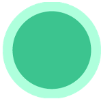
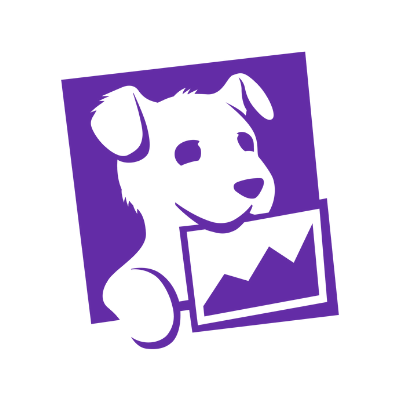
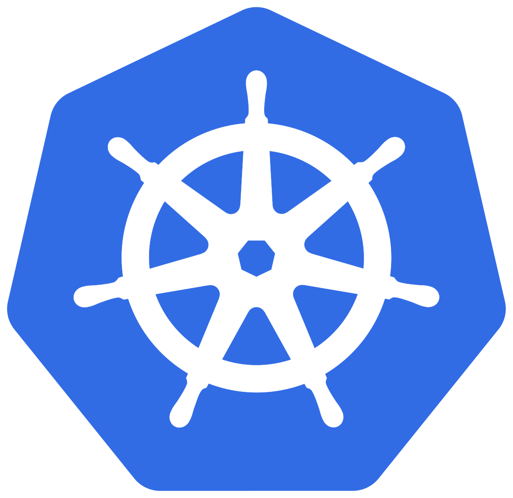
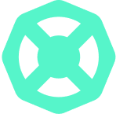
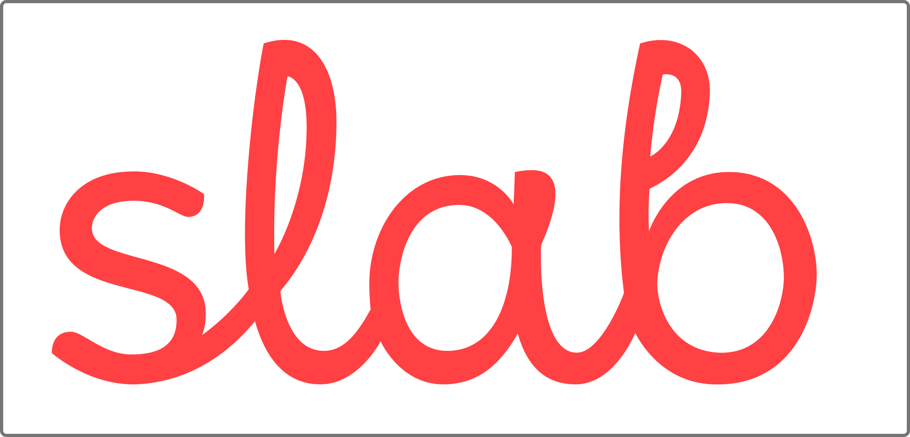
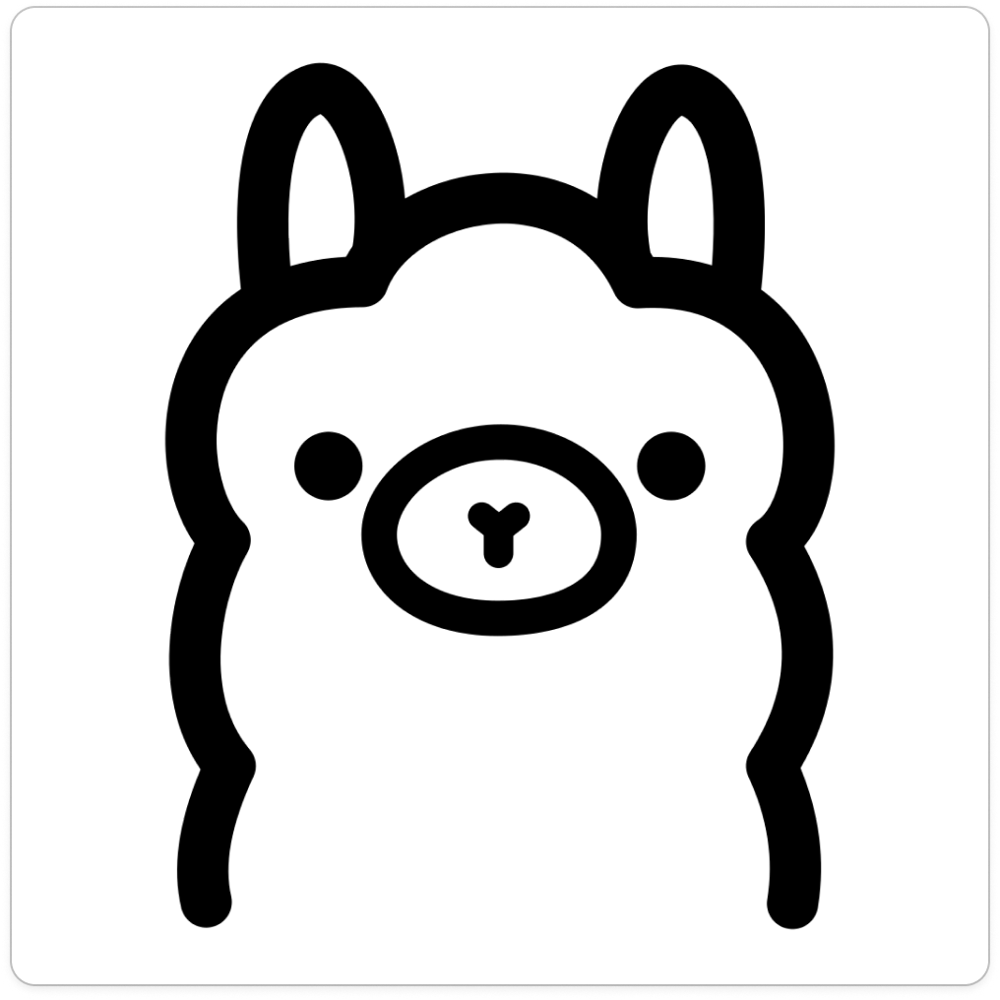

<div align="center">
  <h1 align="center">Solve alerts faster with an AI Agent</h1>
  <p align="center">
    <a href="#how-it-works"><strong>How it Works</strong></a> |
    <a href="#installation"><strong>Installation</strong></a> |
    <a href="#supported-llm-providers"><strong>LLM Providers</strong></a> |
    <a href="https://www.youtube.com/watch?v=TfQfx65LsDQ"><strong>YouTube Demo</strong></a> |
    <a href="https://deepwiki.com/robusta-dev/holmesgpt"></a>
  </p>
</div>

Respond to alerts faster, using AI to automatically:

- Fetch logs, traces, and metrics
- Determine if issues are application or infrastructure related
- Find upstream root-causes

Using HolmesGPT, you can transform your existing alerts from this 👇


To this 👇


### How it Works

HolmesGPT connects AI models with live observability data and organizational knowledge. It uses an **agentic loop** to analyze data from multiple sources and identify possible root causes.


### 🔗 Data Sources

HolmesGPT integrates with popular observability and cloud platforms. The following data sources ("toolsets") are built-in. [Add your own](#customizing-holmesgpt).

| Data Source | Status | Notes |
|-------------|--------|-------|
| [ **ArgoCD**](https://docs.robusta.dev/master/configuration/holmesgpt/toolsets/argocd.html) | ✅ | Get status, history and manifests and more of apps, projects and clusters |
| [ **AWS RDS**](https://docs.robusta.dev/master/configuration/holmesgpt/toolsets/aws.html) | ✅ | Fetch events, instances, slow query logs and more |
| [ **Confluence**](https://docs.robusta.dev/master/configuration/holmesgpt/toolsets/confluence.html) | ✅ | Private runbooks and documentation |
| [ **Coralogix Logs**](https://docs.robusta.dev/master/configuration/holmesgpt/toolsets/coralogix_logs.html) | ✅ | Retrieve logs for any resource |
| [ **Datetime**](https://docs.robusta.dev/master/configuration/holmesgpt/toolsets/datetime.html) | ✅ | Date and time-related operations |
| [ **Docker**](https://docs.robusta.dev/master/configuration/holmesgpt/toolsets/docker.html) | ✅ | Get images, logs, events, history and more |
|  **GitHub** | 🟡 Beta | Remediate alerts by opening pull requests with fixes |
|  **DataDog** | 🟡 Beta | Fetches log data from datadog  |
| [ **Grafana Loki**](https://docs.robusta.dev/master/configuration/holmesgpt/toolsets/grafanaloki.html) | ✅ | Query logs for Kubernetes resources or any query |
| [ **Grafana Tempo**](https://docs.robusta.dev/master/configuration/holmesgpt/toolsets/grafanatempo.html) | ✅ | Fetch trace info, debug issues like high latency in application. |
| [ **Helm**](https://docs.robusta.dev/master/configuration/holmesgpt/toolsets/helm.html) | ✅ | Release status, chart metadata, and values |
| [ **Internet**](https://docs.robusta.dev/master/configuration/holmesgpt/toolsets/internet.html) | ✅ | Public runbooks, community docs etc |
| [ **Kafka**](https://docs.robusta.dev/master/configuration/holmesgpt/toolsets/kafka.html) | ✅ | Fetch metadata, list consumers and topics or find lagging consumer groups |
| [ **Kubernetes**](https://docs.robusta.dev/master/configuration/holmesgpt/toolsets/kubernetes.html) | ✅ | Pod logs, K8s events, and resource status (kubectl describe) |
|  **NewRelic** | 🟡 Beta | Investigate alerts, query tracing data |
| [ **OpenSearch**](https://docs.robusta.dev/master/configuration/holmesgpt/toolsets/opensearch.html) | ✅ | Query health, shard, and settings related info of one or more clusters|
| [ **Prometheus**](https://docs.robusta.dev/master/configuration/holmesgpt/toolsets/prometheus.html) | ✅ | Investigate alerts, query metrics and generate PromQL queries  |
| [ **RabbitMQ**](https://docs.robusta.dev/master/configuration/holmesgpt/toolsets/rabbitmq.html) | ✅ | Info about partitions, memory/disk alerts to troubleshoot split-brain scenarios and more  |
| [ **Robusta**](https://docs.robusta.dev/master/configuration/holmesgpt/toolsets/robusta.html) | ✅ | Multi-cluster monitoring, historical change data, user-configured runbooks, PromQL graphs and more |
| [ **Slab**](https://docs.robusta.dev/master/configuration/holmesgpt/toolsets/slab.html) | ✅ | Team knowledge base and runbooks on demand |

### 🔐 Data Privacy

By design, HolmesGPT has **read-only access** and respects RBAC permissions. It is safe to run in production environments.

We do **not** train HolmesGPT on your data. Data sent to Robusta SaaS is private to your account.

For extra privacy, [bring an API key](https://robusta-dev.github.io/holmesgpt/ai-providers/) for your own AI model.

### 🚀 Bi-Directional Integrations With Your Tools

Robusta can investigate alerts - or just answer questions - from the following sources:

| Integration             | Status    | Notes |
|-------------------------|-----------|-------|
| Slack                   | 🟡 Beta   | [Demo.](https://www.loom.com/share/afcd81444b1a4adfaa0bbe01c37a4847) Tag HolmesGPT bot in any Slack message |
| Prometheus/AlertManager | ✅        | Robusta SaaS or HolmesGPT CLI |
| PagerDuty               | ✅        | HolmesGPT CLI only |
| OpsGenie                | ✅        | HolmesGPT CLI only |
| Jira                    | ✅        | HolmesGPT CLI only |

### See it in Action

<a href="https://www.loom.com/share/388d98aad1a04823b9ed50d0161a4819?sid=a2a669b4-f092-4067-adcb-c8527fbcaa90" target="_blank">

</a>


## Installation

You can install HolmesGPT in one of the follow three methods:

1. [Standalone](https://robusta-dev.github.io/holmesgpt/installation/cli-installation/): Run HolmesGPT from your terminal as a CLI tool. Typically installed with **Homebrew** or **Pip/Pipx**. Ideal for local use, **embedding into shell scripts, or CI/CD pipelines.** (E.g. to analyze why a pipeline deploying to Kubernetes failed.)
2. **Web UIs and TUIs**: HolmesGPT is embedded in several third-party tools, like [Robusta SaaS](https://platform.robusta.dev/signup/?utm_source=github&utm_medium=holmesgpt-readme&utm_content=ways_to_use_holmesgpt_section) and [K9s](https://robusta-dev.github.io/holmesgpt/installation/ui-installation/) (as a plugin).
3. **API**: Embed HolmesGPT in your own app to quickly add **root-cause-analysis functionality and data correlations across multiple sources like logs, metrics, and events**. HolmesGPT exposes an HTTP API and [Python SDK](https://robusta-dev.github.io/holmesgpt/installation/python-installation/), as well as [Helm chart](./helm/) to deploy the HTTP server on Kubernetes.

<table width="100%">
  <tr valign="top">
    <td colspan="2">
      <h3>Standalone</h3>
      <table width="100%">
        <tr>
          <td align="center" width="120">
            <a href="https://robusta-dev.github.io/holmesgpt/installation/cli-installation/">
              <br>
              <strong>Brew</strong>
            </a>
          </td>
          <td align="center" width="120">
            <a href="https://robusta-dev.github.io/holmesgpt/installation/cli-installation/">
              <br>
              <strong>Pipx</strong>
            </a>
          </td>
          <td align="center" width="120">
            <a href="https://robusta-dev.github.io/holmesgpt/installation/cli-installation/">
              <br>
              <strong>Docker</strong>
            </a>
          </td>
          <td align="center" width="120">
            <a href="https://robusta-dev.github.io/holmesgpt/installation/cli-installation/">
              <br>
              <strong>Docker Build</strong>
            </a>
          </td>
          <td align="center" width="120">
            <a href="https://robusta-dev.github.io/holmesgpt/installation/cli-installation/">
              <br>
              <strong>Poetry</strong>
            </a>
          </td>
        </tr>
      </table>
    </td>
  </tr>
  <tr valign="top">
   <td width="30%">
      <h3>Web UIs and TUIs</h3>
      <table>
        <tr>
          <td align="center" width="120">
            <a href="https://platform.robusta.dev/signup/?utm_source=github&utm_medium=holmesgpt-readme&utm_content=ways_to_use_holmesgpt_section">
              <br>
              <strong>Robusta SaaS</strong>
            </a>
          </td>
          <td align="center" width="120">
            <a href="https://robusta-dev.github.io/holmesgpt/installation/ui-installation/">
              <br>
              <strong>K9s Plugin</strong>
            </a>
          </td>
        </tr>
      </table>
    </td>
    <td width="30%">
      <h3>API</h3>
      <table>
        <tr>
          <td align="center" width="120">
            <a href="helm">
              <br>
              <strong>Helm Chart</strong>
            </a>
          </td>
          <td align="center" width="120">
            <a href="https://robusta-dev.github.io/holmesgpt/installation/python-installation/">
              <br>
              <strong>Python API</strong>
            </a>
          </td>
        </tr>
      </table>
    </td>

  </tr>
</table>


## Supported LLM Providers

Select your LLM provider to see how to set up your API Key.

<table>
  <tr>
    <td align="center" width="120">
      <a href="https://robusta-dev.github.io/holmesgpt/ai-providers/openai/">
        <br>
        <strong>OpenAI</strong>
      </a>
    </td>
    <td align="center" width="120">
      <a href="https://robusta-dev.github.io/holmesgpt/ai-providers/anthropic/">
        <br>
        <strong>Anthropic</strong>
      </a>
    </td>
    <td align="center" width="120">
      <a href="https://robusta-dev.github.io/holmesgpt/ai-providers/aws-bedrock/">
        <br>
        <strong>AWS Bedrock</strong>
      </a>
    </td>
    <td align="center" width="120">
      <a href="https://robusta-dev.github.io/holmesgpt/ai-providers/azure-openai/">
        <br>
        <strong>Azure OpenAI</strong>
      </a>
    </td>
    <td align="center" width="120">
      <a href="https://robusta-dev.github.io/holmesgpt/ai-providers/google-vertex-ai/">
        <br>
        <strong>Google Vertex AI</strong>
      </a>
    </td>
  </tr>
  <tr>
    <td align="center" width="120">
      <a href="https://robusta-dev.github.io/holmesgpt/ai-providers/gemini/">
        <br>
        <strong>Gemini</strong>
      </a>
    </td>
    <td align="center" width="120">
      <a href="https://robusta-dev.github.io/holmesgpt/ai-providers/ollama/">
        <br>
        <strong>Ollama</strong>
      </a>
    </td>
  </tr>
</table>

You can also use any OpenAI-compatible models, read [here](https://robusta-dev.github.io/holmesgpt/ai-providers/openai-compatible/) for instructions.

### Using HolmesGPT

- In the Robusta SaaS: Go to [platform.robusta.dev](https://platform.robusta.dev/signup/?utm_source=github&utm_medium=holmesgpt-readme&utm_content=ways_to_use_holmesgpt_section) and use Holmes from your browser
- With HolmesGPT CLI: [setup an LLM API key](https://robusta-dev.github.io/holmesgpt/ai-providers/) and ask Holmes a question 👇

```bash
holmes ask "what pods are unhealthy and why?"
```

You can also provide files as context:
```bash
holmes ask "summarize the key points in this document" -f ./mydocument.txt
```

You can also load the prompt from a file using the `--prompt-file` option:
```bash
holmes ask --prompt-file ~/long-prompt.txt

Enter interactive mode to ask follow-up questions:
```bash
holmes ask "what pods are unhealthy and why?" --interactive
# or
holmes ask "what pods are unhealthy and why?" -i
```

Also supported:

<details>
<summary>HolmesGPT CLI: investigate Prometheus alerts</summary>

Pull alerts from AlertManager and investigate them with HolmesGPT:

```bash
holmes investigate alertmanager --alertmanager-url http://localhost:9093
# if on Mac OS and using the Holmes Docker image👇
#  holmes investigate alertmanager --alertmanager-url http://docker.for.mac.localhost:9093
```

<b>To investigate alerts in your browser, sign up for a free trial of [Robusta SaaS](https://platform.robusta.dev/signup/?utm_source=github&utm_medium=holmesgpt-readme&utm_content=ways_to_use_holmesgpt_section). </b>


<b>Optional:</b> port-forward to AlertManager before running the command mentioned above (if running Prometheus inside Kubernetes)

```bash
kubectl port-forward alertmanager-robusta-kube-prometheus-st-alertmanager-0 9093:9093 &
```
</details>

<details>
<summary>HolmesGPT CLI: investigate PagerDuty and OpsGenie alerts</summary>

```bash
holmes investigate opsgenie --opsgenie-api-key <OPSGENIE_API_KEY>
holmes investigate pagerduty --pagerduty-api-key <PAGERDUTY_API_KEY>
# to write the analysis back to the incident as a comment
holmes investigate pagerduty --pagerduty-api-key <PAGERDUTY_API_KEY> --update
```

For more details, run `holmes investigate <source> --help`
</details>

## Customizing HolmesGPT

HolmesGPT can investigate many issues out of the box, with no customization or training. Optionally, you can extend Holmes to improve results:

**Custom Data Sources**: Add data sources (toolsets) to improve investigations
   - If using Robusta SaaS: See [Robusta's docs](https://docs.robusta.dev/master/configuration/holmesgpt/custom_toolsets.html)
   - If using the CLI: Use `-t` flag with [custom toolset files](./examples/custom_toolset.yaml) or add to `~/.holmes/config.yaml`

**Custom Runbooks**: Give HolmesGPT instructions for known alerts:
   - If using Robusta SaaS: Use the Robusta UI to add runbooks
   - If using the CLI: Use `-r` flag with [custom runbook files](./examples/custom_runbooks.yaml) or add to `~/.holmes/config.yaml`

You can save common settings and API Keys in a config file to avoid passing them from the CLI each time:

<details>
<summary>Reading settings from a config file</summary>

You can save common settings and API keys in config file for re-use. Place the config file in <code>~/.holmes/config.yaml`</code> or pass it using the <code> --config</code>

You can view an example config file with all available settings [here](config.example.yaml).
</details>

## Evals

Because HolmesGPT relies on LLMs, it relies on [a suite of pytest based evaluations](https://robusta-dev.github.io/holmesgpt/development/evals/) to ensure the prompt and HolmesGPT's default set of tools work as expected with LLMs.

- [Introduction to HolmesGPT's evals](https://robusta-dev.github.io/holmesgpt/development/evals/).
- [Write your own evals](https://robusta-dev.github.io/holmesgpt/development/evals/writing/).
- [Use Braintrust to view analyze results (optional)](https://robusta-dev.github.io/holmesgpt/development/evals/reporting/).


## License
Distributed under the MIT License. See [LICENSE.txt](https://github.com/robusta-dev/holmesgpt/blob/master/LICENSE.txt) for more information.
<!-- Change License -->

## Support

If you have any questions, feel free to message us on [robustacommunity.slack.com](https://bit.ly/robusta-slack)

## How to Contribute

Please read our [CONTRIBUTING.md](CONTRIBUTING.md) for guidelines and instructions.

For help, contact us on [Slack](https://bit.ly/robusta-slack) or ask [DeepWiki AI](https://deepwiki.com/robusta-dev/holmesgpt) your questions.

[](https://deepwiki.com/robusta-dev/holmesgpt)
