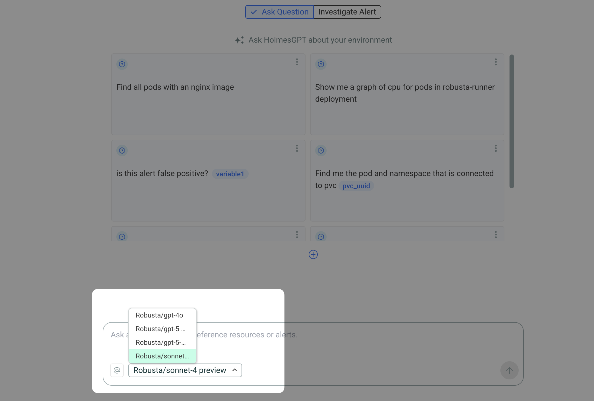

# Robusta AI

Access multiple AI models from different providers through Robusta's unified API, without managing individual API keys.

!!! info "Robusta SaaS Feature"
    Robusta AI is available exclusively for [Robusta SaaS](../installation/ui-installation.md#web-ui-robusta) customers running HolmesGPT in Kubernetes. It provides access to various AI models through a single managed endpoint.

## Overview

Robusta AI simplifies AI model access by:

- **Multi-provider access**: Access a wide variety of models from different providers (OpenAI, Anthropic, and others) through a single interface
- **No API key management**: Use models from multiple providers without managing individual API keys

## Prerequisites

1. **Robusta SaaS account**: You must have an active Robusta platform subscription
2. **Kubernetes deployment**: Robusta AI is only available when running HolmesGPT as a server in Kubernetes (not available in CLI mode)
3. **Robusta platform integration**: Your cluster must be connected to the Robusta platform with a valid `robusta_sink` token
4. **Robusta version**: Requires Robusta version 0.22.0 or higher
5. **Robusta UI sink enabled**: The [Robusta UI sink must be configured](https://docs.robusta.dev/master/configuration/sinks/RobustaUI.html) and operational

## Configuration

Robusta AI is automatically enabled when:

1. HolmesGPT is deployed in [Kubernetes via the Robusta Helm chart](https://docs.robusta.dev/master/setup-robusta/installation/index.html)
2. [A valid Robusta sink is configured in the Robusta Helm Chart](https://docs.robusta.dev/master/configuration/sinks/RobustaUI.html)
3. The `ROBUSTA_AI` environment variable is set to `true`

### Quick Setup

The simplest way to enable HolmesGPT with Robusta AI is to add this to your Robusta Helm values:

```yaml
# Add to generated_values.yaml
enableHolmesGPT: true
```

This automatically:

1. Deploys HolmesGPT as a server in Kubernetes
2. Enables Robusta AI integration
3. Sets up the necessary authentication

### Manual Configuration

For more granular control, you can manually configure Robusta AI:

```yaml
# Add to generated_values.yaml
holmes:
  additionalEnvVars:
    - name: ROBUSTA_AI
      value: "true"
```

### Using Existing Robusta Tokens in Secrets

If your Robusta token is already stored in a Kubernetes secret (common in existing Robusta deployments), you can reference it in HolmesGPT configuration:

```yaml
# Add to generated_values.yaml
holmes:
  additionalEnvVars:
    - name: ROBUSTA_TOKEN
      valueFrom:
        secretKeyRef:
          name: robusta-token-secret
          key: token
    - name: ROBUSTA_AI
      value: "true"
```

Common scenarios for existing secrets:

 - **Existing Robusta UI sink**: If you already have a `robusta_sink` configured, the token is typically stored in a secret named `robusta-token` or similar
 - **Multi-environment deployments**: Use the same secret across different namespaces or clusters
 - **GitOps workflows**: Reference existing secrets managed by ArgoCD or Flux

In most cases, no additional configuration is needed. If you have a valid Robusta deployment, HolmesGPT will automatically:

1. Authenticate with the Robusta platform
2. Fetch available models for your account
3. Make them available for selection

### Disabling Robusta AI

To explicitly disable Robusta AI (for example, if you prefer using your own API keys):

```yaml
# Add to generated_values.yaml
holmes:
  additionalEnvVars:
    - name: ROBUSTA_AI
      value: "false"
```

## How It Works

1. **Authentication**: HolmesGPT reads your Robusta token from the cluster configuration
2. **Session creation**: A session token is created with the Robusta platform
3. **Model discovery**: Available models are fetched from `https://api.robusta.dev/api/llm/models`
4. **Proxy access**: Models are accessed through Robusta's proxy endpoint at `https://api.robusta.dev/llm/{model_name}`
5. **Automatic refresh**: Authentication tokens are automatically refreshed when they expire

## Available Models

The specific models available depend on your Robusta subscription plan. Typically includes:

- OpenAI models (GPT-4o, GPT-4.1, GPT-5, etc.)
- Anthropic models (Claude 4.0 Sonnet, etc.)

## Usage

When Robusta AI is enabled, models appear in the model selector dropdown in the Robusta UI. Users can select any available model for their investigations.



## Troubleshooting

### Models not appearing

Check that:

1. Your Robusta token is valid and not expired
2. HolmesGPT can reach `api.robusta.dev`
3. `ROBUSTA_AI` is set to `true`
4. Check logs for authentication errors

## Environment Variables

| Variable | Description | Default |
|----------|------------|---------|
| `ROBUSTA_AI` | Enable/disable Robusta AI | Auto-detected |
| `ROBUSTA_API_ENDPOINT` | Robusta API endpoint (different for on-premise users) | `https://api.robusta.dev` |

## See Also

- [Using Multiple Providers](using-multiple-providers.md) - Configure multiple AI providers
- [Kubernetes Installation](../installation/kubernetes-installation.md) - Deploy HolmesGPT in Kubernetes
- [Robusta Platform Documentation](https://docs.robusta.dev) - Learn more about Robusta platform integration
