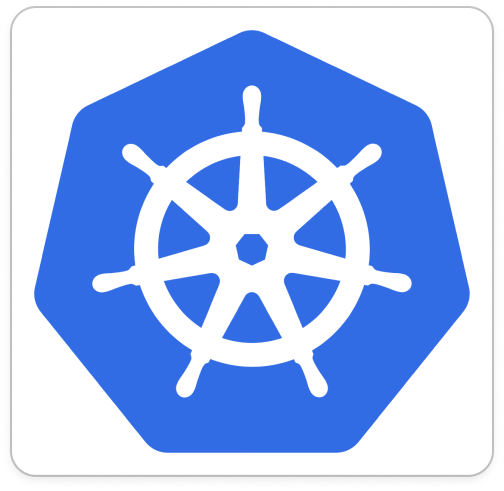

# Built-in Toolsets

Holmes allows defining integrations (toolsets) that fetch data from external sources. Some toolsets are enabled by default, while others require the user to add their own configuration/credentials.

## Available Toolsets

-   :material-git:{ .lg .middle } **ArgoCD**

    ---

    Integration with ArgoCD for GitOps deployment information.

    [:octicons-arrow-right-24: Configuration](argocd.md)

-   :material-aws:{ .lg .middle } **AWS**

    ---

    Amazon Web Services integration for cloud resources.

    [:octicons-arrow-right-24: Configuration](aws.md)

-   :material-book-open:{ .lg .middle } **Confluence**

    ---

    Atlassian Confluence integration for documentation access.

    [:octicons-arrow-right-24: Configuration](confluence.md)

-   :material-chart-line:{ .lg .middle } **Coralogix logs**

    ---

    Coralogix cloud-native observability platform integration.

    [:octicons-arrow-right-24: Configuration](coralogix-logs.md)

-   :material-clock:{ .lg .middle } **Datetime**

    ---

    Time and date utilities for investigations.

    [:octicons-arrow-right-24: Configuration](datetime.md)

-   { width="50" } **Docker**

    ---

    Docker container information and management.

    [:octicons-arrow-right-24: Configuration](docker.md)

-   :material-chart-timeline:{ .lg .middle } **Grafana Loki**

    ---

    Grafana Loki log aggregation system integration.

    [:octicons-arrow-right-24: Configuration](grafanaloki.md)

-   :material-chart-timeline:{ .lg .middle } **Grafana Tempo**

    ---

    Grafana Tempo distributed tracing integration.

    [:octicons-arrow-right-24: Configuration](grafanatempo.md)

-   { width="50" } **Helm**

    ---

    Helm chart and release information.

    [:octicons-arrow-right-24: Configuration](helm.md)

-   :material-web:{ .lg .middle } **Internet**

    ---

    Web searches and external data access.

    [:octicons-arrow-right-24: Configuration](internet.md)

-   :material-server:{ .lg .middle } **Kafka**

    ---

    Apache Kafka cluster information and monitoring.

    [:octicons-arrow-right-24: Configuration](kafka.md)

-   { width="50" } **Kubernetes**

    ---

    Core Kubernetes resources, events, and logs.

    [:octicons-arrow-right-24: Configuration](kubernetes.md)

-   :material-note-text:{ .lg .middle } **Notion**

    ---

    Notion workspace integration for documentation.

    [:octicons-arrow-right-24: Configuration](notion.md)

-   :material-database-search:{ .lg .middle } **OpenSearch logs**

    ---

    OpenSearch log aggregation and search integration.

    [:octicons-arrow-right-24: Configuration](opensearch-logs.md)

-   :material-database-search:{ .lg .middle } **OpenSearch status**

    ---

    OpenSearch cluster status and health monitoring.

    [:octicons-arrow-right-24: Configuration](opensearch-status.md)

-   :material-fire:{ .lg .middle } **Prometheus**

    ---

    Prometheus metrics collection and querying.

    [:octicons-arrow-right-24: Configuration](prometheus.md)

-   :material-rabbit:{ .lg .middle } **RabbitMQ**

    ---

    RabbitMQ message broker monitoring and management.

    [:octicons-arrow-right-24: Configuration](rabbitmq.md)

-   { width="50" } **Robusta**

    ---

    Robusta platform integration for enhanced Kubernetes monitoring.

    [:octicons-arrow-right-24: Configuration](robusta.md)

-   :material-forum:{ .lg .middle } **Slab**

    ---

    Slab team knowledge base integration.

    [:octicons-arrow-right-24: Configuration](slab.md)

-   :material-chart-line:{ .lg .middle } **DataDog**

    ---

    DataDog observability platform integration for logs and monitoring.

    [:octicons-arrow-right-24: Configuration](datadog.md)

-   :material-github:{ .lg .middle } **GitHub**

    ---

    GitHub repository integration for code and documentation access.

    [:octicons-arrow-right-24: Configuration](github.md)

-   :material-chart-box:{ .lg .middle } **New Relic**

    ---

    New Relic APM integration for application performance monitoring.

    [:octicons-arrow-right-24: Configuration](newrelic.md)

-   :material-microsoft-azure:{ .lg .middle } **Azure Kubernetes Service**

    ---

    Azure Kubernetes Service (AKS) cluster management and troubleshooting.

    [:octicons-arrow-right-24: Configuration](aks.md)

-   :material-heart-pulse:{ .lg .middle } **AKS Node Health**

    ---

    Specialized health monitoring for Azure Kubernetes Service nodes.

    [:octicons-arrow-right-24: Configuration](aks-node-health.md)

-   :material-ticket:{ .lg .middle } **ServiceNow**

    ---

    ServiceNow integration for incident and ticket management.

    [:octicons-arrow-right-24: Configuration](servicenow.md)

-   :material-api:{ .lg .middle } **Model Context Protocol**

    ---

    Integration with external MCP servers for custom tools and capabilities.

    [:octicons-arrow-right-24: Configuration](mcp.md)

## Getting Started

1. **Review** the toolsets relevant to your infrastructure
2. **Configure** authentication for external services
3. **Test** investigations to see which data sources are accessed

Some toolsets work automatically with Kubernetes, while external services require API keys or credentials to be configured.
