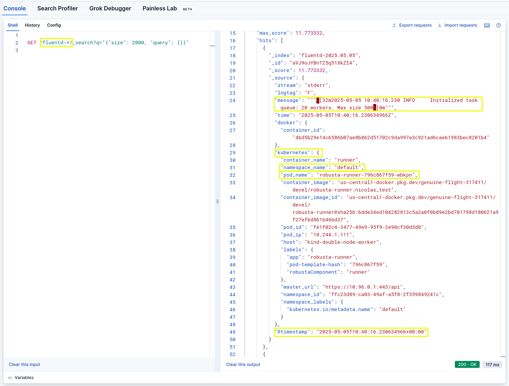

# OpenSearch Logs

By enabling this toolset, HolmesGPT will fetch pod logs from [OpenSearch](https://opensearch.org/).


--8<-- "snippets/toolsets_that_provide_logging.md"

## Configuration

=== "Holmes CLI"

    Add the following to **~/.holmes/config.yaml**, creating the file if it doesn't exist:

    ```yaml
    toolsets:
      opensearch/logs:
        enabled: true
        config:
          opensearch_url: <your opensearch/elastic URL>
          index_pattern: <name of the index to use> # The pattern matching the indexes containing the logs. Supports wildcards. For example `fluentd-*`
          opensearch_auth_header: "ApiKey <...>" # An optional header value set to the `Authorization` header for every request to opensearch
          labels: # set the labels according to how values are mapped in your opensearch cluster
            pod: "kubernetes.pod_name"
            namespace: "kubernetes.namespace_name"
            timestamp: "@timestamp"
            message: "message"

      kubernetes/logs:
        enabled: false # HolmesGPT's default logging mechanism MUST be disabled
    ```

    --8<-- "snippets/toolset_refresh_warning.md"

=== "Robusta Helm Chart"

    ```yaml
    holmes:
      toolsets:
        opensearch/logs:
          enabled: true
          config:
            opensearch_url: https://skdjasid.europe-west1.gcp.cloud.es.io:443 # The URL to your opensearch cluster.
            index_pattern: fluentd-* # The pattern matching the indexes containing the logs. Supports wildcards
            opensearch_auth_header: "ApiKey b0ZlwQWEsdwAkv047bafirkallDFWJIWDWdwlQQ==" # An optional header value set to the `Authorization` header for every request to opensearch.
            labels: # set the labels according to how values are mapped in your opensearch cluster
              pod: "kubernetes.pod_name"
              namespace: "kubernetes.namespace_name"
              timestamp: "@timestamp"
              message: "message"

        kubernetes/logs:
          enabled: false # HolmesGPT's default logging mechanism MUST be disabled
    ```

    --8<-- "snippets/helm_upgrade_command.md"

## Configuring index_pattern and labels

You can tweak the labels used by the toolset to identify kubernetes resources. This is **optional** and only needed if your logs settings differ from the defaults in the example below.

```yaml
toolsets:
  opensearch/logs:
    enabled: true
    config:
      index_pattern: fluentd-*
      labels:
        pod: "kubernetes.pod_name"
        namespace: "kubernetes.namespace_name"
        timestamp: "@timestamp"
        message: "message"
```

Below is a screenshot of a query that was done using Elastic dev tools to find out what should be the values for the labels.



In the image above, the following values and labels are identified by a yellow rectangle:

| Configuration field | Value | Description |
|---|---|---|
| index_pattern | fluentd-* | This defines what opensearch indexes should be used to fetch logs |
| pod | kubernetes.pod_name | The kubernetes pod name |
| namespace | kubernetes.namespace_name | The kubernetes namespace |
| timestamp | @timestamp | This timestamp is used to search logs by time range. |
| message | message | This is the content of the log message |


## Capabilities

| Tool Name | Description |
|-----------|-------------|
| fetch_pod_logs | Retrieve logs using opensearch |
