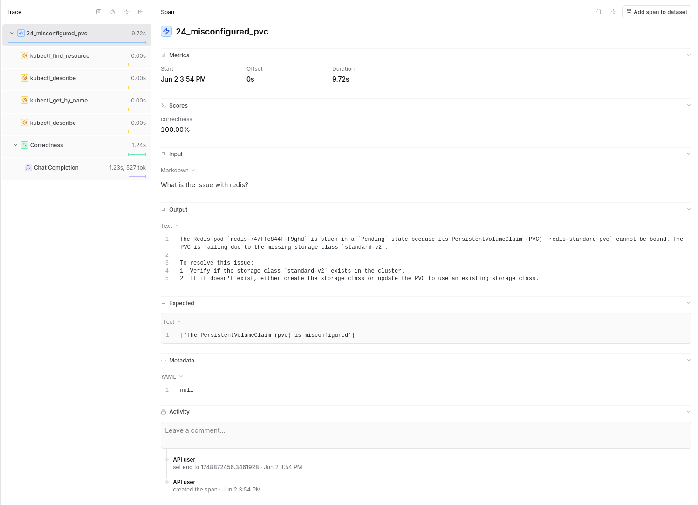
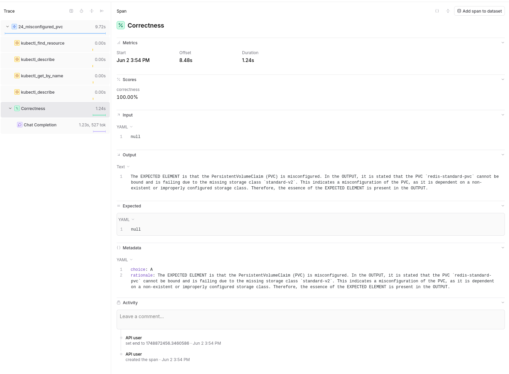
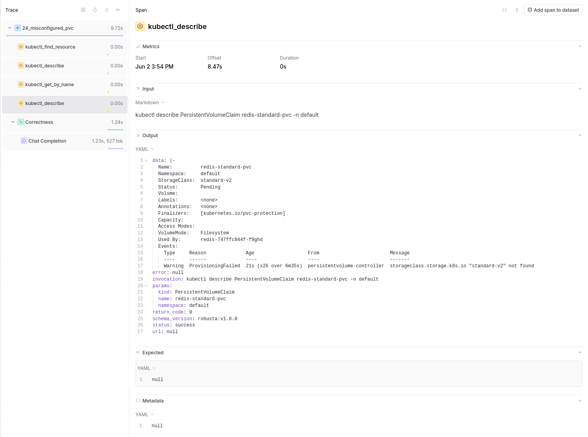

# Reporting with Braintrust

This guide explains how to use Braintrust to analyze evaluation results, debug failures, and compare model performance.

- [Evaluations Overview](index.md) - Introduction to HolmesGPT's evaluation system
- [Writing Evaluations](writing.md) - Learn how to create new test cases and evaluations

## Overview

Braintrust is a platform for tracking and analyzing LLM evaluations. HolmesGPT evals can be used without Braintrust but using Braintrust has a few advantages:

- We can track how Holmes perform over time
- It's easier to run and debug many evals with Braintrust over simpler pytests because Braintrust organises the different components of a HolmesGPT investigation like the input, tool calls, reasoning for scoring, etc.

## Setting Up Braintrust

### 1. Create Account

1. Visit [braintrust.dev](https://www.braintrust.dev){:target="_blank"}
2. Sign up for an account
3. Create a new project (e.g., "HolmesGPT")

### 2. Get API Key

1. Click your profile icon (top right)
2. Go to Settings → API Keys
3. Generate a new API key
4. Copy the key (starts with `sk-`)

### 3. Configure Environment

```bash
export BRAINTRUST_API_KEY=sk-your-api-key-here
```

## Running Evaluations with Braintrust

### Basic Evaluation Run

```bash
export BRAINTRUST_API_KEY=sk-your-key
export UPLOAD_DATASET=true

pytest ./tests/llm/test_ask_holmes.py
```

### Named Experiment

```bash
export EXPERIMENT_ID=baseline_gpt4o
export MODEL=gpt-4o
pytest -n 10 ./tests/llm/test_*.py
```

### Key Environment Variables

| Variable | Purpose |
|----------|---------|
| `UPLOAD_DATASET` | Sync test cases to Braintrust |
| `EXPERIMENT_ID` | Name your experiment run. This makes it easier to find and track in Braintrust's UI |
| `MODEL` | The LLM model for Holmes to use |
| `CLASSIFIER_MODEL` | The LLM model to use for scoring the answer (LLM as judge) |

## Analyzing Evaluation Results

### Output

The main Span of an evaluation will present the input (either the AlertManager issue or the user's question for Ask Holmes) as well as HolmesGPT's answer.



### Score Types

**Correctness Score**:
- Measures accuracy of LLM responses
- Values: 0 or 1
- Shows how well output matches expectations



## Debugging Failed Evaluations

### 1. Identify Failing Tests

In the experiment view:
- Sort by score (ascending) to see worst performers
- Filter by specific score types
- Look for patterns in failures

### 2. Examine Tool Call Traces

Click on a failing test to see:
- **Input**: The original prompt/question
- **Tool Calls**: Which tools the LLM invoked
- **Tool Results**: What data each tool returned
- **Output**: The LLM's final response
- **Expected**: What the test expected



### 3. Common Failure Patterns

**Low Correctness Score**:
- LLM missed key information in tool outputs
- Response doesn't address the core question
- Factual errors in the analysis

**Low Context Score**:
- LLM didn't reference important context items
- May indicate prompt engineering issues
- Could suggest irrelevant context was provided

**Missing Tool Calls**:
- LLM didn't invoke necessary tools
- Check if tool descriptions are clear
- Verify mock data is realistic

### 4. Debug Example

**Failing Test**: "02_what_is_wrong_with_pod"
- **Score**: Correctness 0.2, Context 0.1
- **Issue**: LLM said "pod is healthy" but expected "CrashLoopBackOff detected"

**Investigation**:
1. Check `kubectl_describe.txt` mock - contains correct CrashLoopBackOff status
2. Verify `kubectl_logs.txt` shows crash errors
3. Review LLM's tool calls - did it call `kubectl_describe`?
4. Examine LLM output - did it misinterpret the kubectl output?

**Solution**: Update mock files to be more explicit about the crash status
