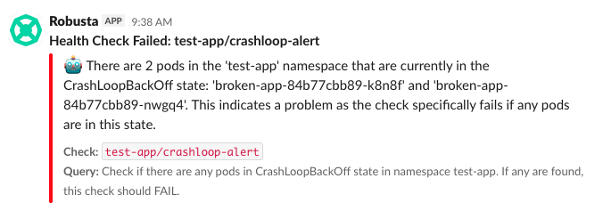

# Building and Testing the Holmes Operator

This guide covers building, testing, and developing the Holmes Operator for Kubernetes health checks.

## Prerequisites

1. **Kubernetes cluster** - minikube, kind, Docker Desktop, or any K8s cluster
2. **Skaffold** - Install with `brew install skaffold` (macOS) or from [skaffold.dev](https://skaffold.dev)
3. **API key** - OpenAI or Anthropic API key set as environment variable
4. **Container registry** - Access to a registry like docker.io/yourusername or ghcr.io/yourusername

Note: The skaffold.yaml is configured to build linux/amd64 images by default (required for most Kubernetes clusters) regardless of your host machine's architecture.

## Quick Start

There are two ways to provide API keys for local development:

### Method 1: Environment Variables (Recommended)
```bash
# Export your API key locally
export OPENAI_API_KEY="sk-..."  # or ANTHROPIC_API_KEY

# Run Skaffold - it will automatically inject your API key into containers
# using setValueTemplates defined in the dev profile (see skaffold.yaml)
skaffold dev --default-repo=<your-registry>
```

### Method 2: Local Values File

```bash
# Create a local values file (already gitignored)
cp helm/holmes/values.local.yaml.example helm/holmes/values.local.yaml
# Edit values.local.yaml and add your API key

# Tell Skaffold to use your local values file
skaffold dev --default-repo=<your-registry> \
  --profile=dev \
  -f skaffold.yaml \
  --helm-set-file helm.releases[0].valuesFiles[1]=helm/holmes/values.local.yaml
```

## Troubleshooting

### General Options

```bash
# To reduce log verbosity (default can be too verbose), use INFO level
skaffold dev --default-repo=<your-registry> --verbosity=info

# To install in a different namespace (default is holmes-operator)
skaffold dev --default-repo=<your-registry> --namespace=my-namespace
```

### CRD Conflicts from Previous Installations

If you encounter CRD conflicts (common when switching between installations):

```bash
# CRDs are cluster-scoped and retain Helm ownership metadata
kubectl delete crd healthchecks.holmes.robusta.dev scheduledhealthchecks.holmes.robusta.dev

# If deletion hangs due to finalizers (existing resources blocking deletion):
kubectl patch crd healthchecks.holmes.robusta.dev -p '{"metadata":{"finalizers":[]}}' --type=merge
kubectl patch crd scheduledhealthchecks.holmes.robusta.dev -p '{"metadata":{"finalizers":[]}}' --type=merge
```

## Testing the Operator

This section walks through progressively more advanced operator functionality.

### 1. Basic Health Check

Start with a simple one-time health check that executes immediately when created:

```bash
# Create a namespace for testing
kubectl create namespace test-app

# Apply a basic health check
kubectl apply -f - <<EOF
apiVersion: holmes.robusta.dev/v1alpha1
kind: HealthCheck
metadata:
  name: pod-health-check
  namespace: test-app
spec:
  query: "Are all pods in namespace test-app healthy and running?"
  mode: monitor
  # model: gpt-4.1  # Optional: specify model (defaults to gpt-4.1 if omitted)
                    # Requires corresponding API key configured in the operator deployment:
                    # - Via environment variable (OPENAI_API_KEY or ANTHROPIC_API_KEY)
                    # - Or in helm/holmes/values.yaml under modelList configuration
                    # If using modelList, must match a configured model name there
EOF

# Watch the check execute (it runs immediately upon creation)
kubectl get healthcheck pod-health-check -n test-app -w

# View the results
kubectl get healthcheck -n test-app
# NAME               STATUS      DURATION   QUERY                           MESSAGE                        AGE
# pod-health-check   Completed   5.2        Are all pods in namespace te... Check passed. All pods are... 10s

# See detailed status
kubectl describe healthcheck pod-health-check -n test-app
```

### 2. Re-running Checks

You can re-run an existing check using an annotation:

```bash
# Re-run the check
kubectl annotate healthcheck pod-health-check -n test-app \
  holmes.robusta.dev/rerun=true --overwrite

# Watch it execute again
kubectl get healthcheck pod-health-check -n test-app -w

# The annotation is automatically removed after execution
kubectl get healthcheck pod-health-check -n test-app -o yaml | grep rerun
# (should show nothing - annotation was cleaned up)
```

### 3. Slack Integration

For checks that fail, you can send alerts to Slack. Here's what a failed health check looks like in Slack:



The notification includes:
- Check name and namespace
- Detailed failure reason with pod names
- Query that was executed
- Direct link to the check in Kubernetes

```bash
# First, deploy a broken app that will trigger a failure
kubectl apply -f - <<EOF
apiVersion: apps/v1
kind: Deployment
metadata:
  name: broken-app
  namespace: test-app
spec:
  replicas: 1
  selector:
    matchLabels:
      app: broken-app
  template:
    metadata:
      labels:
        app: broken-app
    spec:
      containers:
      - name: app
        image: busybox
        command: ["sh", "-c", "exit 1"]  # Always fails
EOF

# Create a check with Slack alerting
# Note: Requires SLACK_TOKEN configured in Holmes deployment
kubectl apply -f - <<EOF
apiVersion: holmes.robusta.dev/v1alpha1
kind: HealthCheck
metadata:
  name: crashloop-alert
  namespace: test-app
spec:
  query: "Check if there are any pods in CrashLoopBackOff state in namespace test-app. If any are found, this check should FAIL."
  mode: alert  # Alert mode sends notifications
  destinations:
    - type: slack
      config:
        channel: "#alerts"  # Override default channel if needed
EOF

# The check will execute, fail, and send a Slack notification
kubectl get healthcheck crashloop-alert -n test-app
# NAME              STATUS      DURATION   QUERY                           MESSAGE
# crashloop-alert   Completed   3.8        Check if there are any pods... Check failed. There are 1...

# View operator logs to confirm Slack notification was sent
kubectl logs -l app=holmes-operator -n holmes-operator | grep -i slack
# Should show: "Sent Slack notification to #alerts for check test-app/crashloop-alert"
```

### 4. Scheduled Health Checks

For recurring checks on a schedule:

⚠️ **Warning**: Scheduled health checks consume LLM API credits with each execution. Example costs:

- Hourly checks: ~$216/month (24 checks/day × 30 days × $0.30/check)
- Daily checks: ~$9/month (1 check/day × 30 days × $0.30/check)
- Weekly checks: ~$1.20/month (4 checks/month × $0.30/check)

```bash
# Create a scheduled check that runs once per hour
kubectl apply -f - <<EOF
apiVersion: holmes.robusta.dev/v1alpha1
kind: ScheduledHealthCheck
metadata:
  name: periodic-health-check
  namespace: test-app
spec:
  schedule: "0 * * * *"  # Cron format: every hour on the hour
  enabled: true
  checkSpec:
    query: "Check the overall health of namespace test-app. Report any issues with pods, services, or deployments."
    mode: monitor
EOF

# View the scheduled check
kubectl get scheduledhealthcheck -n test-app
# NAME                    SCHEDULE    ENABLED   LAST RESULT   LAST RUN   AGE
# periodic-health-check   0 * * * *   true                                28s
# Note: LAST RUN and LAST RESULT are empty until the check runs (at the top of the hour)

# Force an immediate run (for testing, since waiting for the hour is impractical)
kubectl annotate scheduledhealthcheck periodic-health-check -n test-app \
  holmes.robusta.dev/run-now="$(date +%s)" --overwrite

# This creates a new HealthCheck resource with a timestamped name
kubectl get healthcheck -n test-app | grep periodic
# periodic-health-check-20250919-065444-3e9c5b   Failed   9.3   ...

# Now the scheduled check shows the execution results
kubectl get scheduledhealthcheck -n test-app
# NAME                    SCHEDULE    ENABLED   LAST RESULT   LAST RUN   AGE
# periodic-health-check   0 * * * *   true      fail          9s         2m

# View execution history
kubectl describe scheduledhealthcheck periodic-health-check -n test-app
# Shows last 10 executions with results and duration

# Delete the scheduled check when done testing
kubectl delete scheduledhealthcheck periodic-health-check -n test-app
```

### 5. Cleanup

```bash
# Delete test resources
kubectl delete namespace test-app

# This automatically deletes all health checks and scheduled checks in that namespace
```

## Building and Deployment

```bash
# Build operator image
docker build -t holmes-operator:latest operator/

# One-time deployment
skaffold run --default-repo=<your-registry>

# Clean up
skaffold delete
```

## Project Structure

```
operator/
├── main.py              # Operator implementation
├── requirements.txt     # Python dependencies
├── Dockerfile          # Container image
├── test/               # Test resources
│   ├── test-healthchecks.yaml
│   ├── test-scheduled-healthchecks.yaml
│   └── test-deployment.yaml
```

## What Gets Deployed

Running `skaffold dev` deploys:

- Holmes API Server with `/api/check/execute` endpoint
- Holmes Operator to manage HealthCheck CRDs
- Test applications and sample health checks

**What Skaffold does:**

1. Build and push Docker images to your registry
2. Deploy to your Kubernetes cluster
3. Automatically set up port-forwarding from cluster services to localhost
4. Stream logs and watch for code changes (hot reload in dev mode)

After deployment, you can access services locally via Skaffold's port-forwarding:

- API: http://localhost:9090
- Operator metrics: http://localhost:9091

## Configuration

### Environment Variables

The operator and API require the following environment variables:

```bash
# Required: API keys (choose one)
export OPENAI_API_KEY="sk-..."     # For OpenAI models
export ANTHROPIC_API_KEY="sk-..."  # For Anthropic models

# Optional: Operator configuration
HOLMES_API_URL=http://holmes-api:8080  # API endpoint (auto-configured in cluster)
LOG_LEVEL=INFO                         # Logging level
```

### How API Keys are Injected

When using `skaffold dev`, your local environment variables are automatically injected into containers using Skaffold's `setValueTemplates` feature. This is configured in the `dev` profile of `skaffold.yaml`:

- Skaffold reads your local `OPENAI_API_KEY` or `ANTHROPIC_API_KEY`
- It passes these as Helm values during deployment
- The Helm chart creates Kubernetes secrets and mounts them in pods

Alternatively, you can use a local values file (see Method 2 in Quick Start) for more complex configurations.


## Monitoring and Debugging

**View Logs**

```bash
# Stream all logs (aggregated by Skaffold)
skaffold logs -f

# Filter by deployment
skaffold logs -f -d holmes-holmes-operator

# Direct kubectl logs
kubectl logs -l app=holmes-operator -n test-app -f
```

**Check Metrics**

```bash
# Operator exposes Prometheus metrics
curl http://localhost:9091/metrics

# Key metrics:
# - holmes_checks_scheduled_total
# - holmes_checks_executed_total
# - holmes_checks_failed_total
# - holmes_check_duration_seconds
```

## Advanced Usage

**Direct API Testing**

```bash
# Test check execution endpoint
curl -X POST http://localhost:9090/api/check/execute \
  -H "Content-Type: application/json" \
  -H "X-Check-Name: test/manual-check" \
  -d '{
    "query": "Are all pods in the default namespace healthy?",
    "timeout": 30,
    "mode": "monitor"
  }'
```

## Running Operator Locally

For debugging or development without containers:

```bash
# Install dependencies
pip install -r operator/requirements.txt

# Deploy only the Holmes API service without the operator deployment
# This allows you to run the operator locally for debugging
SKIP_OPERATOR=true skaffold run

# Run operator locally against the deployed API
HOLMES_API_URL=http://localhost:9090 \
  poetry run kopf run -A --standalone operator/main.py
```

## Next Steps

- [Operator Architecture](../reference/operator-architecture.md) - Technical deep dive
- [Health Checks Guide](../walkthrough/operator-health-checks.md) - Using health checks
- [API Reference](../reference/http-api.md) - Check execution endpoint details
