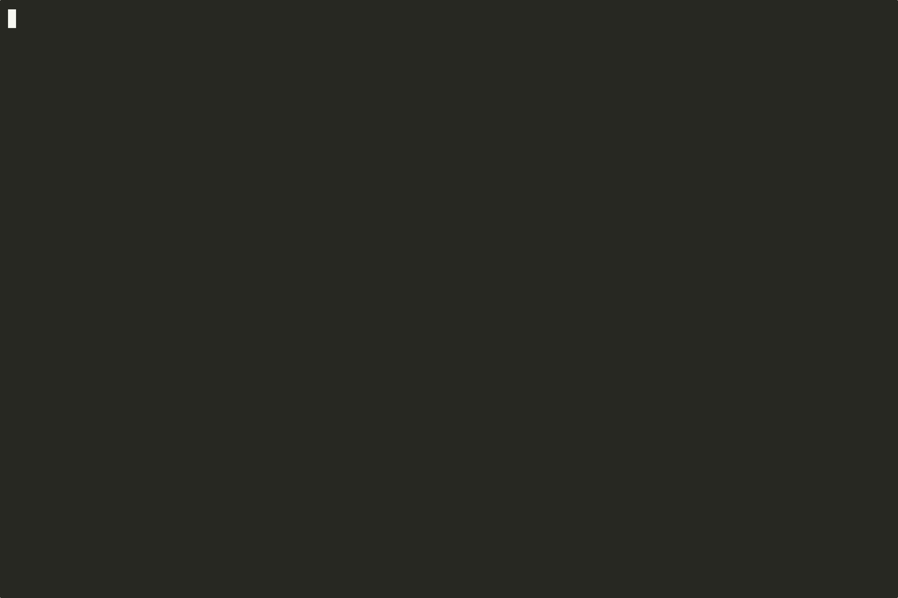

# HolmesGPT

AI Agent for Troubleshooting Cloud-Native Environments.

## Quick Start

-   :material-console:{ .lg .middle } **[Install CLI](installation/cli-installation.md)**

    ---

    Run HolmesGPT from your terminal

    [:octicons-arrow-right-24: Install](installation/cli-installation.md)

-   :material-web:{ .lg .middle } **[Install UI/TUI](installation/ui-installation.md)**

    ---

    Use through a web interface or K9s plugin

    [:octicons-arrow-right-24: Install](installation/ui-installation.md)

## Advanced Installation Options

* **[Helm Chart](installation/kubernetes-installation.md)** - Deploy HolmesGPT as a service and use via HTTP API
* **[Python SDK](installation/python-installation.md)** - Embed HolmesGPT in your applications

## Next Steps

- **[AI Provider Setup](ai-providers/index.md)** - Configure your AI provider
- **[Run Your First Investigation](walkthrough/index.md)** - Complete walkthrough with examples
- **[Add integrations](data-sources/index.md)** - Connect monitoring tools like Prometheus and Grafana
- **[HTTP API Reference](reference/http-api.md)** - API documentation for custom integrations
- **[Troubleshooting guide](reference/troubleshooting.md)** - Common issues and solutions

## Need Help?

- **[Join our Slack](https://robustacommunity.slack.com){:target="_blank"}** - Get help from the community
- **[Request features on GitHub](https://github.com/robusta-dev/holmesgpt/issues){:target="_blank"}** - Suggest improvements or report bugs
