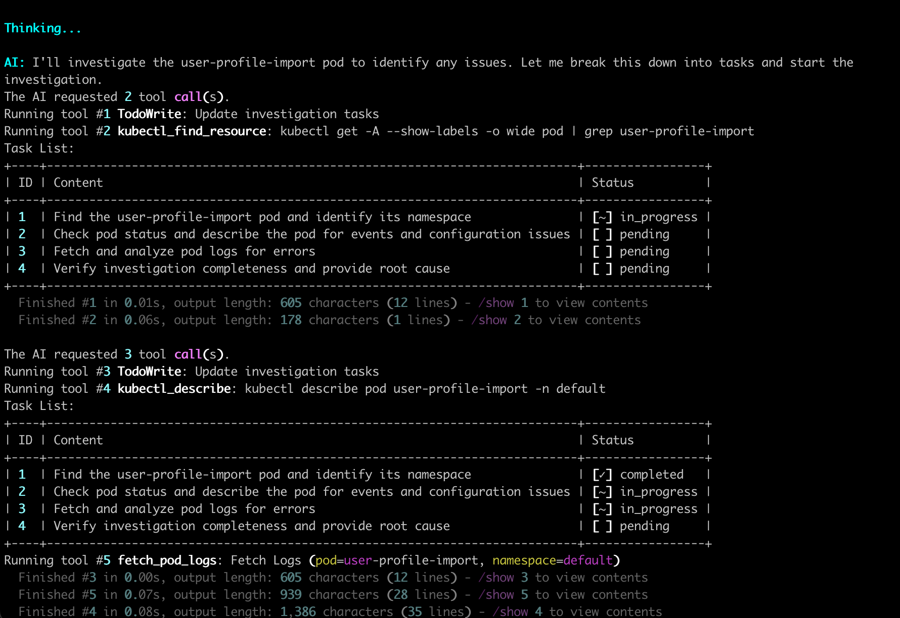
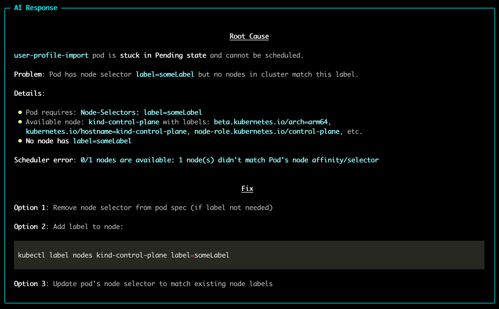

# Install CLI

Run HolmesGPT from your terminal as a standalone CLI tool.

<div style="position: relative; padding-bottom: 56.25%; height: 0; overflow: hidden;">
  <iframe src="https://www.youtube.com/embed/JwMqqh6LQQI" 
          style="position: absolute; top: 0; left: 0; width: 100%; height: 100%;" 
          frameborder="0" 
          allow="accelerometer; autoplay; clipboard-write; encrypted-media; gyroscope; picture-in-picture" 
          allowfullscreen>
  </iframe>
</div>

## Installation Options

=== "Homebrew (Mac/Linux)"

    1. Add our tap:
       ```bash
       brew tap robusta-dev/homebrew-holmesgpt
       ```

    2. Install HolmesGPT:
       ```bash
       brew install holmesgpt
       ```

    3. To upgrade to the latest version:
       ```bash
       brew upgrade holmesgpt
       ```

    4. Verify installation:
       ```bash
       holmes ask --help
       ```

=== "Pipx"

    1. Install [pipx](https://pypa.github.io/pipx/installation/){:target="_blank"}

    2. Install HolmesGPT:
       ```bash
       pipx install holmesgpt
       ```

    3. Verify installation:
       ```bash
       holmes ask --help
       ```

=== "From Source (Poetry)"

    For development or custom builds:

    1. Install [Poetry](https://python-poetry.org/docs/#installation){:target="_blank"}

    2. Install HolmesGPT:
       ```bash
       git clone https://github.com/robusta-dev/holmesgpt.git
       cd holmesgpt
       poetry install --no-root
       ```

    3. Verify installation:
       ```bash
       poetry run holmes ask --help
       ```

=== "Docker Container"

    Run HolmesGPT using the prebuilt Docker container:

    ```bash
    docker run -it --net=host \
      -e OPENAI_API_KEY="your-api-key" \
      -v ~/.holmes:/root/.holmes \
      -v ~/.aws:/root/.aws \
      -v ~/.config/gcloud:/root/.config/gcloud \
      -v $HOME/.kube/config:/root/.kube/config \
      us-central1-docker.pkg.dev/genuine-flight-317411/devel/holmes ask "what pods are unhealthy and why?"
    ```

    > **Note:** Use `-e` flags to pass API keys for your provider (e.g., `-e ANTHROPIC_API_KEY`, `-e GEMINI_API_KEY`). See [Environment Variables Reference](../reference/environment-variables.md) for the complete list.

## Quick Start

Choose your AI provider (see [all providers](../ai-providers/index.md) for more options).

!!! tip "Which Model to Use"
We highly recommend using Sonnet 4.0 or Sonnet 4.5 as it gives the best results by far. These models are available from Anthropic, AWS Bedrock, and Google Vertex. [View Benchmarks.](../development/evaluations/index.md)

=== "Anthropic Claude"

    1. **Set up API key**:
        ```bash
        export ANTHROPIC_API_KEY="your-api-key"
        ```

    2. **Create a test pod** to investigate:
        ```bash
        kubectl apply -f https://raw.githubusercontent.com/robusta-dev/kubernetes-demos/main/pending_pods/pending_pod_node_selector.yaml
        ```

    3. **Ask your first question**:
        ```bash
        holmes ask "what is wrong with the user-profile-import pod?" --model="anthropic/claude-sonnet-4-5-20250929"
        ```

    **Note**: You can use any Anthropic model by changing the model name. See [Claude Models Overview](https://docs.claude.com/en/docs/about-claude/models/overview#latest-models-comparison){:target="_blank"} for available model names.

    See [Anthropic Configuration](../ai-providers/anthropic.md) for more details.

=== "OpenAI"

    1. **Set up API key**:
        ```bash
        export OPENAI_API_KEY="your-api-key"
        ```

    2. **Create a test pod** to investigate:
        ```bash
        kubectl apply -f https://raw.githubusercontent.com/robusta-dev/kubernetes-demos/main/pending_pods/pending_pod_node_selector.yaml
        ```

    3. **Ask your first question**:
        ```bash
        # Uses gpt-4.1 by default (fairly fast, decent results)
        holmes ask "what is wrong with the user-profile-import pod?"

        # Or specify a different model
        holmes ask "what is wrong with the user-profile-import pod?" --model="gpt-5"
        ```

    See [OpenAI Configuration](../ai-providers/openai.md) for more details.

=== "Azure OpenAI"

    1. **Set up API key**:
        ```bash
        export AZURE_API_VERSION="2024-02-15-preview"
        export AZURE_API_BASE="https://your-resource.openai.azure.com"
        export AZURE_API_KEY="your-azure-api-key"
        ```

    2. **Create a test pod** to investigate:
        ```bash
        kubectl apply -f https://raw.githubusercontent.com/robusta-dev/kubernetes-demos/main/pending_pods/pending_pod_node_selector.yaml
        ```

    3. **Ask your first question**:
        ```bash
        holmes ask "what is wrong with the user-profile-import pod?" --model="azure/<your-model-name>"
        ```

    See [Azure OpenAI Configuration](../ai-providers/azure-openai.md) for more details.

=== "AWS Bedrock"

    1. **Set up API key**:
        ```bash
        export AWS_ACCESS_KEY_ID="your-access-key"
        export AWS_SECRET_ACCESS_KEY="your-secret-key"
        export AWS_DEFAULT_REGION="your-region"
        ```

    2. **Install boto3**:
        ```bash
        pip install "boto3>=1.28.57"
        ```

    3. **Create a test pod** to investigate:
        ```bash
        kubectl apply -f https://raw.githubusercontent.com/robusta-dev/kubernetes-demos/main/pending_pods/pending_pod_node_selector.yaml
        ```

    4. **Ask your first question**:
        ```bash
        # Recommended: Use Sonnet 4.0 or Sonnet 4.5 for best results
        holmes ask "what is wrong with the user-profile-import pod?" --model="bedrock/anthropic.claude-sonnet-4-20250514-v1:0"

        # Or use another model
        holmes ask "what is wrong with the user-profile-import pod?" --model="bedrock/<your-model-name>"
        ```

    See [AWS Bedrock Configuration](../ai-providers/aws-bedrock.md) for more details.

=== "Google Gemini"

    1. **Set up API key**:
        ```bash
        export GEMINI_API_KEY="your-gemini-api-key"
        ```

    2. **Create a test pod** to investigate:
        ```bash
        kubectl apply -f https://raw.githubusercontent.com/robusta-dev/kubernetes-demos/main/pending_pods/pending_pod_node_selector.yaml
        ```

    3. **Ask your first question**:
        ```bash
        holmes ask "what is wrong with the user-profile-import pod?" --model="gemini/<your-gemini-model>"
        ```

    See [Google Gemini Configuration](../ai-providers/gemini.md) for more details.

=== "Google Vertex AI"

    1. **Set up credentials**:
        ```bash
        export VERTEXAI_PROJECT="your-project-id"
        export VERTEXAI_LOCATION="us-central1"
        export GOOGLE_APPLICATION_CREDENTIALS="path/to/service-account-key.json"
        ```

    2. **Create a test pod** to investigate:
        ```bash
        kubectl apply -f https://raw.githubusercontent.com/robusta-dev/kubernetes-demos/main/pending_pods/pending_pod_node_selector.yaml
        ```

    3. **Ask your first question**:
        ```bash
        holmes ask "what is wrong with the user-profile-import pod?" --model="vertex_ai/<your-vertex-model>"
        ```

    See [Google Vertex AI Configuration](../ai-providers/google-vertex-ai.md) for more details.

=== "Ollama"

    1. **Set up API key**:
        No API key required for local Ollama installation.

    2. **Create a test pod** to investigate:
        ```bash
        kubectl apply -f https://raw.githubusercontent.com/robusta-dev/kubernetes-demos/main/pending_pods/pending_pod_node_selector.yaml
        ```

    3. **Ask your first question**:
        ```bash
        holmes ask "what is wrong with the user-profile-import pod?" --model="ollama/<your-model-name>"
        ```

        For troubleshooting and advanced options, see [Ollama Configuration](../ai-providers/ollama.md).

    > **Warning:** Ollama can be tricky to configure correctly. We recommend trying HolmesGPT with a hosted model first (like Claude or OpenAI) to ensure everything works before switching to Ollama.

HolmesGPT will automatically look into the cluster, inspect the pod, and return an explanation in plain English.

You’ll usually see details like:

-   Why a pod is **pending or crashing**
-   Whether it’s missing a **node selector or image**
-   Or if it’s hitting a **resource limit or scheduling issue**





## Next Steps

-   **[Add Data Sources](../data-sources/index.md)** - We encourage you to use built-in toolsets to connect with AWS, Prometheus, Loki, NewRelic, DataDog, ArgoCD, Confluence, and other monitoring tools.
-   **[Connect Remote MCP Servers](../data-sources/remote-mcp-servers.md)** - Extend capabilities with external MCP servers.

## Need Help?

-   **[Join our Slack](https://bit.ly/robusta-slack){:target="\_blank"}** - Get help from the community
-   **[Request features on GitHub](https://github.com/robusta-dev/holmesgpt/issues){:target="\_blank"}** - Suggest improvements or report bugs.
-   **[Troubleshooting guide](../reference/troubleshooting.md)** - Common issues and solutions.
