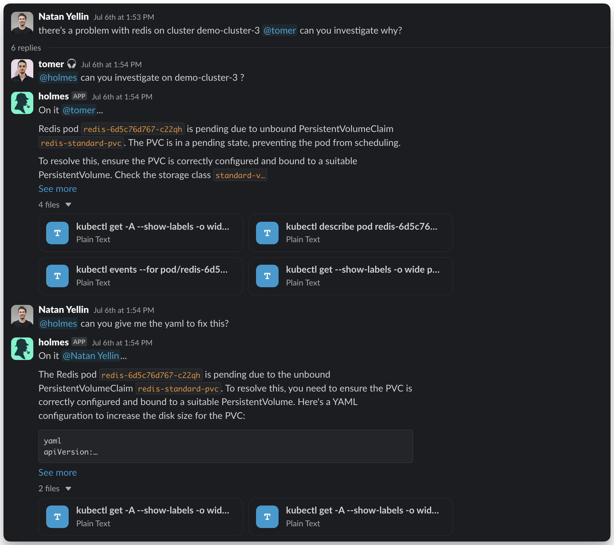

# Install UI/Slack/K9s

Use HolmesGPT through graphical and terminal interfaces via third-party integrations.

## K9s Plugin

Integrate HolmesGPT into your [K9s](https://github.com/derailed/k9s){:target="_blank"} Kubernetes terminal for instant analysis.


### Prerequisites

- **K9s must be installed** - See the [K9s installation guide](https://github.com/derailed/k9s#installation){:target="_blank"}
- **HolmesGPT CLI and API key** - Follow the [CLI Installation Guide](cli-installation.md) to install Holmes and configure your AI provider

### Plugin Options

??? note "Basic Plugin (Shift + H) - Quick investigation with predefined question"

    Add to your K9s plugins configuration file:

    - **Linux**: `~/.config/k9s/plugins.yaml` or `~/.k9s/plugins.yaml`
    - **macOS**: `~/Library/Application Support/k9s/plugins.yaml` or `~/.k9s/plugins.yaml`
    - **Windows**: `%APPDATA%/k9s/plugins.yaml`

    Read more about K9s plugins [here](https://k9scli.io/topics/plugins/){:target="_blank"} and check your plugin path [here](https://k9scli.io/topics/config/){:target="_blank"}.

    ```yaml
    plugins:
      holmesgpt:
        shortCut: Shift-H
        description: Ask HolmesGPT
        scopes:
          - all
        command: bash
        background: false
        confirm: false
        args:
          - -c
          - |
            # Check if we're already using the correct context
            CURRENT_CONTEXT=$(kubectl config current-context 2>/dev/null || echo "")
            if [ "$CURRENT_CONTEXT" = "$CONTEXT" ]; then
              # Already using the correct context, run HolmesGPT directly
              holmes ask "why is $NAME of $RESOURCE_NAME in -n $NAMESPACE not working as expected"
            else
              # Create temporary kubeconfig to avoid changing user's system context
              # K9s passes $CONTEXT but we need to ensure HolmesGPT uses the same context
              # without permanently switching the user's kubectl context
              TEMP_KUBECONFIG=$(mktemp)
              kubectl config view --raw > $TEMP_KUBECONFIG
              KUBECONFIG=$TEMP_KUBECONFIG kubectl config use-context $CONTEXT
              # KUBECONFIG environment variable is passed to holmes and all its child processes
              KUBECONFIG=$TEMP_KUBECONFIG holmes ask "why is $NAME of $RESOURCE_NAME in -n $NAMESPACE not working as expected"
              rm -f $TEMP_KUBECONFIG
            fi
            echo "Press 'q' to exit"
            while : ; do
            read -n 1 k <&1
            if [[ $k = q ]] ; then
            break
            fi
            done
    ```

??? note "Advanced Plugin (Shift + Q) - Interactive plugin with custom questions"


    Add to your K9s plugins configuration file:

    - **Linux**: `~/.config/k9s/plugins.yaml` or `~/.k9s/plugins.yaml`
    - **macOS**: `~/Library/Application Support/k9s/plugins.yaml` or `~/.k9s/plugins.yaml`
    - **Windows**: `%APPDATA%/k9s/plugins.yaml`

    Read more about K9s plugins [here](https://k9scli.io/topics/plugins/){:target="_blank"} and check your plugin path [here](https://k9scli.io/topics/config/){:target="_blank"}.

    ```yaml
    plugins:
      custom-holmesgpt:
        shortCut: Shift-Q
        description: Custom HolmesGPT Ask
        scopes:
          - all
        command: bash
        background: false
        confirm: false
        args:
          - -c
          - |
            INSTRUCTIONS="# Edit the line below. Lines starting with '#' will be ignored."
            DEFAULT_ASK_COMMAND="why is $NAME of $RESOURCE_NAME in -n $NAMESPACE not working as expected"
            QUESTION_FILE=$(mktemp)

            echo "$INSTRUCTIONS" > "$QUESTION_FILE"
            echo "$DEFAULT_ASK_COMMAND" >> "$QUESTION_FILE"

            # Open the line in the default text editor
            ${EDITOR:-nano} "$QUESTION_FILE"

            # Read the modified line, ignoring lines starting with '#'
            user_input=$(grep -v '^#' "$QUESTION_FILE")

            echo "Running: holmes ask '$user_input'"
            # Check if we're already using the correct context
            CURRENT_CONTEXT=$(kubectl config current-context 2>/dev/null || echo "")
            if [ "$CURRENT_CONTEXT" = "$CONTEXT" ]; then
              # Already using the correct context, run HolmesGPT directly
              holmes ask "$user_input"
            else
              # Create temporary kubeconfig to avoid changing user's system context
              # K9s passes $CONTEXT but we need to ensure HolmesGPT uses the same context
              # without permanently switching the user's kubectl context
              TEMP_KUBECONFIG=$(mktemp)
              kubectl config view --raw > $TEMP_KUBECONFIG
              KUBECONFIG=$TEMP_KUBECONFIG kubectl config use-context $CONTEXT
              # KUBECONFIG environment variable is passed to holmes and all its child processes
              KUBECONFIG=$TEMP_KUBECONFIG holmes ask "$user_input"
              rm -f $TEMP_KUBECONFIG
            fi
            echo "Press 'q' to exit"
            while : ; do
            read -n 1 k <&1
            if [[ $k = q ]] ; then
            break
            fi
            done
    ```

### Usage

1. Run K9s and select any Kubernetes resource
2. Press **Shift + H** for quick analysis or **Shift + Q** for custom questions


## Web UI (Robusta)

The fastest way to use HolmesGPT is via the managed Robusta SaaS platform.

=== "AWS Troubleshooting"

    <div style="position: relative; padding-bottom: 56.25%; height: 0;">
        <iframe src="https://www.loom.com/embed/2e5e3a259a5c41018914c9abd8429f00"
                frameborder="0"
                webkitallowfullscreen
                mozallowfullscreen
                allowfullscreen
                style="position: absolute; top: 0; left: 0; width: 100%; height: 100%;">
        </iframe>
    </div>

=== "CPU Spike Investigation"

    <div style="position: relative; padding-bottom: 56.25%; height: 0;">
        <iframe src="https://www.loom.com/embed/b63f0eba0fd74750929f37c16b3fca3b"
                frameborder="0"
                webkitallowfullscreen
                mozallowfullscreen
                allowfullscreen
                style="position: absolute; top: 0; left: 0; width: 100%; height: 100%;">
        </iframe>
    </div>

=== "Tempo Tracing Integration"

    [](https://www.loom.com/share/388d98aad1a04823b9ed50d0161a4819?sid=a2a669b4-f092-4067-adcb-c8527fbcaa90){:target="_blank"}

### Get Started

1. **Sign up:** [platform.robusta.dev](https://platform.robusta.dev/signup/?utm_source=docs&utm_medium=holmesgpt-docs&utm_content=ui_installation_section){:target="_blank"}
2. **Connect your cluster:** Follow the in-app wizard
3. **Ask Holmes:** Analyze alerts or troubleshoot issues

!!! tip "Multiple AI Providers"
    You can configure multiple AI models for users to choose from in the UI. See [Using Multiple Providers](../ai-providers/using-multiple-providers.md) for configuration details.

---

## Slack Bot (Robusta)

First install Robusta SaaS, then tag HolmesGPT in any Slack message for instant analysis.



### Setup Slack Bot

[](https://www.loom.com/share/7a60a42e854e45368e9b7f9d3c36ae5f?sid=bfed9efb-b607-416c-b481-c2a63d314a4b){:target="_blank"}

## Need Help?

- **[Join our Slack](https://bit.ly/robusta-slack){:target="_blank"}** - Get help from the community
- **[Request features on GitHub](https://github.com/robusta-dev/holmesgpt/issues){:target="_blank"}** - Suggest improvements or report bugs
- **[Troubleshooting guide](../reference/troubleshooting.md)** - Common issues and solutions
