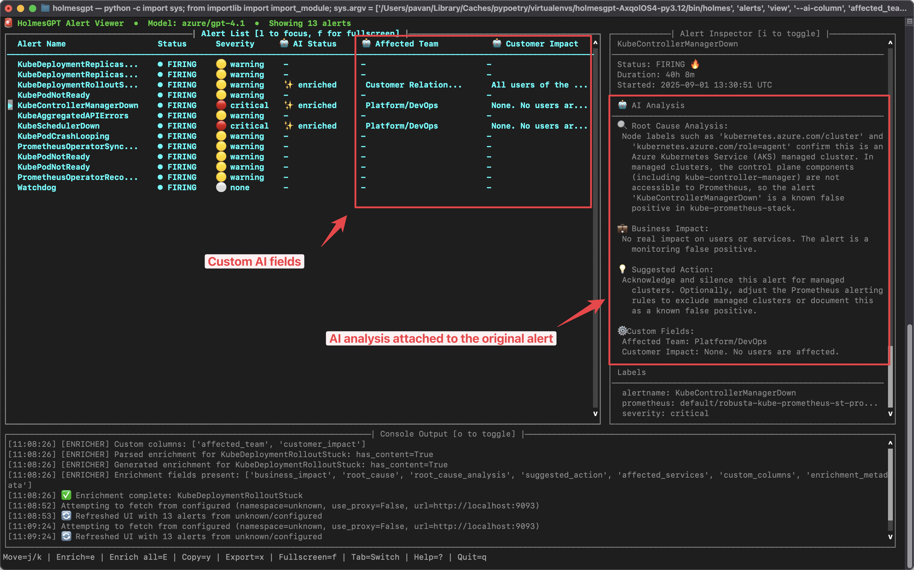

# Auto-Enrich Prometheus Alerts

Turn cryptic alerts into actionable insights with AI enrichment.



## Getting Started

=== "CLI (Local)"

    **1. Configure AlertManager URL:**

    Option 1: Set in config file (`~/.holmes/config.yaml`):
    ```yaml
    alertmanager_url: http://localhost:9093
    ```

    Option 2: Set via environment variable:
    ```bash
    export ALERTMANAGER_URL=http://localhost:9093
    ```

    Option 3: Pass directly with `--alertmanager-url` flag after port-forwarding AlertManager (see examples below)

    **2. View and enrich alerts:**

    ```bash
    # View alerts from AlertManager (uses URL from config or environment)
    holmes alerts view

    # Specify AlertManager URL manually (e.g., after port-forwarding)
    holmes alerts view --alertmanager-url http://localhost:9093

    # With custom AI enrichment columns
    holmes alerts view \
      --alertmanager-url http://localhost:9093 \
      --ai-column "affected_team=Which team owns this?" \
      --ai-column "customer_impact=How many users affected?"

    # Filter by severity
    holmes alerts view --alertmanager-url http://localhost:9093 --severity critical,warning
    ```

=== "Docker (Testing)"

    **1. Start the proxy container:**

    ```bash
    # Basic setup
    docker run -d \
      --name holmes-proxy \
      -e OPENAI_API_KEY=$OPENAI_API_KEY \
      -p 8080:8080 \
      ghcr.io/robusta-dev/holmesgpt \
      holmes alertmanager-proxy serve

    # With Slack notifications
    docker run -d \
      --name holmes-proxy \
      -e OPENAI_API_KEY=$OPENAI_API_KEY \
      -e SLACK_WEBHOOK_URL=$SLACK_WEBHOOK \
      -p 8080:8080 \
      ghcr.io/robusta-dev/holmesgpt \
      holmes alertmanager-proxy serve
    ```

    **2. Configure AlertManager:**

    ```yaml
    # alertmanager.yaml
    receivers:
      - name: holmes-proxy
        webhook_configs:
          - url: http://host.docker.internal:8080/webhook  # On Mac/Windows
          # - url: http://172.17.0.1:8080/webhook          # On Linux
    ```

    **3. Monitor the container:**

    ```bash
    # View logs
    docker logs -f holmes-proxy

    # Check health
    curl http://localhost:8080/health

    # Stop and remove
    docker stop holmes-proxy
    docker rm holmes-proxy
    ```

=== "Kubernetes (Production)"

    **1. Create namespace and secrets:**

    ```bash
    kubectl create namespace holmes

    # Create secret for API key
    kubectl create secret generic holmes \
      --from-literal=api-key=$OPENAI_API_KEY \
      --from-literal=slack-webhook=$SLACK_WEBHOOK \
      -n holmes
    ```

    **2. Deploy HolmesGPT Proxy:**

    ```yaml
    apiVersion: apps/v1
    kind: Deployment
    metadata:
      name: holmes-proxy
      namespace: holmes
    spec:
      replicas: 2
      selector:
        matchLabels:
          app: holmes-proxy
      template:
        metadata:
          labels:
            app: holmes-proxy
        spec:
          containers:
          - name: proxy
            image: ghcr.io/robusta-dev/holmesgpt:latest
            command: ["holmes", "alertmanager-proxy", "serve"]
            env:
            - name: OPENAI_API_KEY
              valueFrom:
                secretKeyRef:
                  name: holmes
                  key: api-key
            - name: SLACK_WEBHOOK_URL
              valueFrom:
                secretKeyRef:
                  name: holmes
                  key: slack-webhook
            ports:
            - containerPort: 8080
    ---
    apiVersion: v1
    kind: Service
    metadata:
      name: holmes-proxy
      namespace: holmes
    spec:
      selector:
        app: holmes-proxy
      ports:
      - port: 8080
        targetPort: 8080
    ```

    ```bash
    kubectl apply -f holmes-proxy.yaml
    ```

    **3. Configure AlertManager:**

    ```yaml
    # alertmanager.yaml
    receivers:
      - name: holmes-proxy
        webhook_configs:
          - url: http://holmes-proxy.holmes.svc.cluster.local:8080/webhook

    route:
      receiver: holmes-proxy
    ```

    **4. Verify deployment:**

    ```bash
    # Check pod status
    kubectl get pods -n holmes

    # View logs
    kubectl logs -f deployment/holmes-proxy -n holmes
    ```

## How It Works

Every alert now includes:

- **Business Impact** - "Affecting 1,200 checkout users"
- **Root Cause** - "Memory leak from unclosed DB connections"
- **Suggested Fix** - "Restart pod or scale replicas"
- **Related Issues** - Links to correlated alerts

## Examples

### Example: OOM Kill Alert

**Original Alert:**
```yaml
alertname: KubePodCrashLooping
pod: payment-processor-5d4
```

**AI-Enriched Version:**
```yaml
summary: "Payment processor crashing due to memory limits"
business_impact: "~450 payments/hour failing, $12K revenue risk"
root_cause: "Pod requesting 512Mi but needs 1.2Gi for current load"
action: "Update deployment: memory request to 1.5Gi"
evidence: "10x traffic spike at 14:15, memory grew from 400Mi to 1.3Gi"
```

### Example: Database Alert

**Original Alert:**
```yaml
alertname: PostgresConnectionPoolExhausted
instance: postgres-primary
```

**AI-Enriched Version:**
```yaml
summary: "Database rejecting new connections, affecting 3 services"
business_impact: "Login and checkout completely down"
root_cause: "Leaked connections from api-server pods after deploy"
action: "1) Kill idle connections 2) Restart api-server pods"
affected_services: ["api-server", "checkout", "auth-service"]
```

## Custom AI Fields

Add organization-specific insights:

```bash
# Business-focused fields
holmes alertmanager-proxy serve \
  --ai-column "affected_team=Which team owns this?" \
  --ai-column "customer_impact=How many users affected?" \
  --ai-column "revenue_risk=Revenue impact per hour?"

# Technical analysis
holmes alertmanager-proxy serve \
  --ai-column "root_cause=Find the technical root cause" \
  --ai-column "runbook=Step-by-step fix instructions" \
  --ai-column "prevent=How to prevent this in future?"
```


## Advanced Features

### Severity Filtering

Filter which alerts get enriched based on severity:

=== "CLI"
    ```bash
    holmes alertmanager-proxy serve --severity critical,warning
    ```

=== "Docker"
    ```bash
    docker run -d \
      -e OPENAI_API_KEY=$OPENAI_API_KEY \
      -p 8080:8080 \
      ghcr.io/robusta-dev/holmesgpt \
      holmes alertmanager-proxy serve --severity critical,warning
    ```

=== "Kubernetes"
    ```yaml
    # In deployment spec
    command: ["holmes", "alertmanager-proxy", "serve"]
    args:
      - "--port=8080"
      - "--severity=critical,warning"
    ```


## Monitoring

=== "CLI/Docker"
    ```bash
    # Check proxy health
    curl http://localhost:8080/health

    # View statistics
    curl http://localhost:8080/stats
    ```

=== "Kubernetes"
    ```bash
    # Check proxy health
    kubectl port-forward -n holmes svc/holmes-proxy 8080:8080
    curl http://localhost:8080/health

    # View statistics
    curl http://localhost:8080/stats
    ```

Response example:
```json
{
  "alerts_processed": 1523,
  "enriched": 1511,
  "cache_hits": 512,
  "avg_enrichment_time": "1.2s"
}
```

## Troubleshooting

### Not receiving alerts?

=== "CLI"
    ```bash
    # Check connectivity
    curl -X POST http://localhost:8080/webhook -d '{}'

    # Enable debug logs
    holmes alertmanager-proxy serve -vv
    ```

=== "Docker"
    ```bash
    # Check connectivity
    curl -X POST http://localhost:8080/webhook -d '{}'

    # View container logs
    docker logs -f holmes-proxy

    # Run with debug logs
    docker run -it \
      -e OPENAI_API_KEY=$OPENAI_API_KEY \
      -p 8080:8080 \
      ghcr.io/robusta-dev/holmesgpt \
      holmes alertmanager-proxy serve -vv
    ```

=== "Kubernetes"
    ```bash
    # Check connectivity
    kubectl port-forward -n holmes svc/holmes-proxy 8080:8080
    curl -X POST http://localhost:8080/webhook -d '{}'

    # View pod logs
    kubectl logs -f deployment/holmes-proxy -n holmes
    ```

### Enrichment failing?

=== "CLI"
    ```bash
    # Test API key
    export OPENAI_API_KEY=sk-...
    holmes ask "test"

    # Run with verbose logging
    holmes alertmanager-proxy serve -vv
    ```

=== "Docker"
    ```bash
    # Test API key in container
    docker run --rm \
      -e OPENAI_API_KEY=$OPENAI_API_KEY \
      ghcr.io/robusta-dev/holmesgpt \
      holmes ask "test"

    # Check container logs
    docker logs holmes-proxy
    ```

=== "Kubernetes"
    ```bash
    # Check secret exists
    kubectl get secret holmes -n holmes

    # Check proxy logs
    kubectl logs -f deployment/holmes-proxy -n holmes --tail=100
    ```

## FAQ

**Q: Does it work with PagerDuty/OpsGenie?**
A: The proxy currently supports forwarding to Slack and AlertManager. For PagerDuty/OpsGenie, you can forward enriched alerts to AlertManager which then routes to these services.

**Q: Can I use my own LLM?**
A: Yes, supports OpenAI, Anthropic, Azure, Bedrock, and local models via the --model flag.
