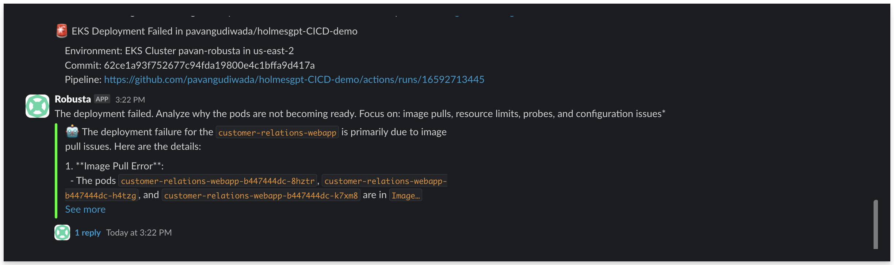

# CI/CD Pipeline Troubleshooting

HolmesGPT can be integrated into CI/CD pipelines to automatically troubleshoot deployment failures, providing instant insights when deployments fail. Optionally, you can get the AI investigation results sent directly to your Slack channel.



## Automated Deployment Troubleshooting

Example of using HolmesGPT in a CI/CD pipeline to automatically troubleshoot deployment failures and send results to Slack:

```yaml
# .github/workflows/deploy.yml or gitlab-ci.yml
- name: Install HolmesGPT
  run: |
    # Clone the branch of holmes you want to install
    git clone -b slack-markdown-fix https://github.com/robusta-dev/holmesgpt.git /tmp/holmesgpt
    cd /tmp/holmesgpt

    # Install Poetry
    curl -sSL https://install.python-poetry.org | python3 - --version 1.4.0
    export PATH="$HOME/.local/bin:$PATH"

    # Install dependencies using Poetry
    poetry install

- name: Deploy to EKS
  env:
    OPENAI_API_KEY: ${{ secrets.OPENAI_API_KEY }}
  run: |
    # Apply Kubernetes manifests
    kubectl apply -f https://raw.githubusercontent.com/robusta-dev/kubernetes-demos/refs/heads/main/image_pull_backoff/no_such_image.yaml
    # Wait for rollout
    if ! kubectl rollout status deployment/customer-relations-webapp --timeout=150s; then
      echo "Deployment failed - starting HolmesGPT investigation"
      # Run HolmesGPT investigation and send directly to Slack
      cd /tmp/holmesgpt
      poetry run holmes ask \
        "🚨 EKS Deployment Failed in ${{ github.repository }}

        Environment: EKS Cluster ${{ vars.EKS_CLUSTER_NAME }} in ${{ vars.AWS_REGION }}
        Commit: ${{ github.sha }}
        Pipeline: ${{ github.server_url }}/${{ github.repository }}/actions/runs/${{ github.run_id }}

        The deployment failed. Analyze why the pods are not becoming ready. Focus on: image pulls, resource limits, probes, and configuration issues" \
        --no-interactive \
        --destination slack \
        --slack-token "${{ secrets.SLACK_TOKEN }}" \
        --slack-channel "#YOUR_CHANNEL_NAME"
      exit 1
    fi
```

??? example "Complete Example GitHub Actions Workflow"

    ```yaml
    name: Deploy to Production

    on:
      push:
        branches:
          - main
      workflow_dispatch:

    jobs:
      deploy:
        runs-on: ubuntu-latest

        steps:
        - name: Checkout code
          uses: actions/checkout@v4

        - name: Configure AWS credentials
          uses: aws-actions/configure-aws-credentials@v4
          with:
            aws-access-key-id: ${{ secrets.AWS_ACCESS_KEY_ID }}
            aws-secret-access-key: ${{ secrets.AWS_SECRET_ACCESS_KEY }}
            aws-region: ${{ vars.AWS_REGION }}

        - name: Set up kubectl
          uses: azure/setup-kubectl@v3
          with:
            version: v1.28.0

        - name: Configure kubectl for EKS
          run: |
            aws eks update-kubeconfig --region ${{ vars.AWS_REGION }} --name ${{ vars.EKS_CLUSTER_NAME }}
            # Get current user ARN and add to cluster access
            USER_ARN=$(aws sts get-caller-identity --query Arn --output text)
            aws eks create-access-entry --cluster-name ${{ vars.EKS_CLUSTER_NAME }} --principal-arn $USER_ARN --region ${{ vars.AWS_REGION }} || true
            aws eks associate-access-policy --cluster-name ${{ vars.EKS_CLUSTER_NAME }} --principal-arn $USER_ARN --policy-arn arn:aws:eks::aws:cluster-access-policy/AmazonEKSClusterAdminPolicy --access-scope type=cluster --region ${{ vars.AWS_REGION }} || true

        - name: Debug kubeconfig
          run: |
            echo "Testing kubectl connection..."
            kubectl config current-context > /dev/null
            kubectl cluster-info > /dev/null
            kubectl auth can-i get pods --namespace=default > /dev/null
            echo "kubectl connection verified"

        - name: Install HolmesGPT
          run: |
            # Clone the branch of holmes you want to install
            git clone -b slack-markdown-fix https://github.com/robusta-dev/holmesgpt.git /tmp/holmesgpt
            cd /tmp/holmesgpt

            # Install Poetry
            curl -sSL https://install.python-poetry.org | python3 - --version 1.4.0
            export PATH="$HOME/.local/bin:$PATH"

            # Install dependencies using Poetry
            poetry install

        - name: Deploy to EKS
          env:
            OPENAI_API_KEY: ${{ secrets.OPENAI_API_KEY }}
          run: |
            # Apply Kubernetes manifests
            kubectl apply -f https://raw.githubusercontent.com/robusta-dev/kubernetes-demos/refs/heads/main/image_pull_backoff/no_such_image.yaml
            # Wait for rollout
            if ! kubectl rollout status deployment/customer-relations-webapp --timeout=150s; then
              echo "Deployment failed - starting HolmesGPT investigation"
              # Run HolmesGPT investigation and send directly to Slack
              cd /tmp/holmesgpt
              poetry run holmes ask \
                "🚨 EKS Deployment Failed in ${{ github.repository }}

                Environment: EKS Cluster ${{ vars.EKS_CLUSTER_NAME }} in ${{ vars.AWS_REGION }}
                Commit: ${{ github.sha }}
                Pipeline: ${{ github.server_url }}/${{ github.repository }}/actions/runs/${{ github.run_id }}

                The deployment failed. Analyze why the pods are not becoming ready. Focus on: image pulls, resource limits, probes, and configuration issues" \
                --no-interactive \
                --destination slack \
                --slack-token "${{ secrets.SLACK_TOKEN }}" \
                --slack-channel "#YOUR_CHANNEL_NAME"
              exit 1
            fi
    ```

## Simplified Approaches

The built-in Slack integration will automatically format and send the analysis to your specified channel. You can also use a simpler approach for basic deployments:

```bash
# Simple deployment check with Slack notification
kubectl rollout status deployment/app -n prod --timeout=300s || \
  holmes ask "deployment/app in prod namespace failed to roll out" \
    --destination slack \
    --slack-token "$SLACK_TOKEN" \
    --slack-channel "#alerts"
```
