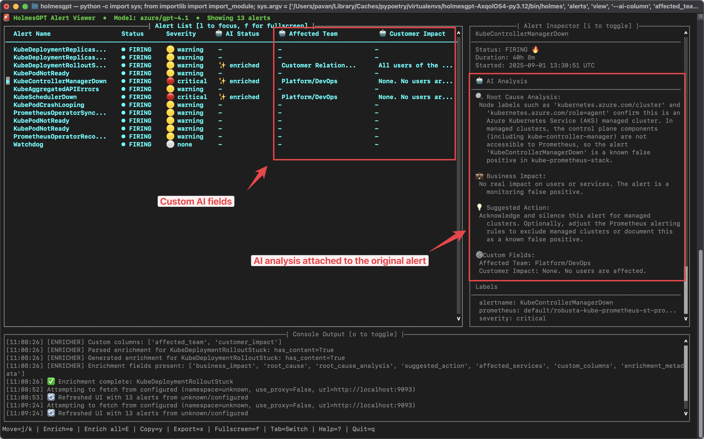

# Investigating Prometheus Alerts Locally

View and analyze AlertManager alerts with AI-powered insights using the interactive TUI.



## Overview

The `holmes alerts view` command provides an interactive terminal UI for viewing and enriching AlertManager alerts in real-time. Perfect for local development and troubleshooting.

## Prerequisites

- HolmesGPT CLI installed ([installation guide](../installation/cli-installation.md))
- An AI provider API key configured ([setup guide](../ai-providers/index.md))
- Access to your AlertManager instance (auto-discovery works in Kubernetes)

## Configuration

**Set up AlertManager URL:**

Option 1: Configure in `~/.holmes/config.yaml`:
```yaml
alerrtmanager_url: http://localhost:9093
```

Option 2: Set environment variable:
```bash
export ALERTMANAGER_URL=http://localhost:9093
```

Option 3: Pass directly via command line (see examples below)

## Quick Start

```bash
# Auto-discover AlertManager in your cluster - no configuration needed!
holmes alerts view

# View alerts from a specific AlertManager
holmes alerts view --alertmanager-url http://localhost:9093

# Enrich ALL alerts with AI on startup (may be expensive!)
# Without this flag, you can manually enrich individual alerts with 'e' key
holmes alerts view --enable-enrichment

# Add custom AI columns for analysis
holmes alerts view \
  --ai-column "root_cause=identify the technical root cause" \
  --ai-column "affected_team=which team owns this service"
```

## Features

- **Real-time Updates** - Polls AlertManager every 30 seconds
- **Auto-discovery** - Automatically finds AlertManager instances in Kubernetes
- **Three-pane Layout**:

    - Alert list with status and AI enrichment
    - Inspector for detailed alert information
    - Console for enrichment logs

- **Vim-style Navigation** - Keyboard shortcuts for efficient browsing
- **AI Enrichment** - Two modes:

    - Manual: Press 'e' to enrich selected alert or 'E' for all alerts
    - Automatic: Use `--enable-enrichment` flag to enrich all alerts on startup

## Keyboard Shortcuts

**Navigation:**

- `j/k` - Move down/up in the current pane
- `g/G` - Go to top/bottom of current pane
- `PgUp/PgDn` - Page up/down
- `Tab` - Switch between panes
- `l` - Focus alert list
- `i` - Toggle inspector pane
- `o` - Toggle console output

**Actions:**

- `e` - Enrich selected alert with AI
- `E` - Enrich all alerts
- `r` - Refresh alerts
- `/` - Start search
- `Enter` - Apply search filter
- `Esc` - Cancel search/clear filter
- `?` - Show help
- `q` - Quit

## Additional Commands

### List Alerts (Non-Interactive)

Quickly list all current alerts in table or JSON format:

```bash
# List all alerts in a table
holmes alerts list

# List alerts from specific AlertManager
holmes alerts list --alertmanager-url http://localhost:9093

# Output as JSON for scripting
holmes alerts list --format json

# Filter by severity
holmes alerts list --severity critical

# Filter by specific label
holmes alerts list --label "namespace=production"
```

## Examples

**Monitor production alerts locally:**

```bash
# Port-forward production AlertManager
kubectl port-forward -n monitoring svc/alertmanager 9093:9093

# View with enrichment
holmes alerts view \
  --alertmanager-url http://localhost:9093 \
  --enable-enrichment \
  --ai-column "runbook=step-by-step resolution"
```

**Custom AI analysis columns:**

```bash
holmes alerts view \
  --ai-column "root_cause=identify the technical root cause" \
  --ai-column "affected_team=which team owns this service" \
  --ai-column "business_impact=what is the business impact" \
  --ai-column "suggested_action=recommend immediate action"
```

## What's Next?
- **[Add new data sources](../data-sources/index.md)** - Connect HolmesGPT to your databases, APM tools, and custom APIs for deeper investigations.
- **[Set up remote MCP](../data-sources/remote-mcp-servers.md)** - Add data sources as remote Model Context Protocol (MCP) servers.
