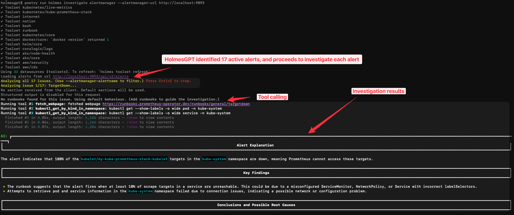

# Investigating Prometheus Alerts

You can investigate Prometheus/AlertManager alerts using HolmesGPT by connecting it to your AlertManager instance. This allows you to run investigations on all active alerts or a specific alert and optionally send the results to a Slack channel.

## Prerequisites

- HolmesGPT CLI installed ([installation guide](../installation/cli-installation.md))
- An AI provider API key configured ([setup guide](../ai-providers/index.md))
- Access to your AlertManager instance

## Investigating a Prometheus Alert Using HolmesGPT


### Step 1: Forward AlertManager

First, you need to forward the AlertManager service to your local machine so HolmesGPT can connect to it. Run the following command in your terminal:

```bash
kubectl port-forward svc/<Your-Alertmanager-Service> 9093:9093
```

### Step 2: Create a Test Alert

Now we'll deploy a crashing workload and simulate an alert from AlertManager.

```bash
kubectl apply -f https://raw.githubusercontent.com/robusta-dev/kubernetes-demos/main/crashpod/broken.yaml
```
Since it takes some time for the alert to be generated, we will manually send a `KubePodCrashLooping` alert to AlertManager for testing purposes. To do this run:
```bash
# Send a KubePodCrashLooping alert directly to AlertManager
curl -X POST http://localhost:9093/api/v1/alerts \
  -H "Content-Type: application/json" \
  -d '[
    {
      "labels": {
        "alertname": "KubePodCrashLooping",
        "severity": "warning",
        "namespace": "default",
        "pod": "payment-processing-worker",
        "container": "worker",
        "job": "kubernetes-pods"
      },
      "annotations": {
        "description": "Pod default/payment-processing-worker is crash looping",
        "summary": "Pod is in CrashLoopBackOff state"
      },
      "generatorURL": "http://prometheus:9090/graph?g0.expr=increase%28kube_pod_container_status_restarts_total%5B1h%5D%29%20%3E%205",
      "startsAt": "'$(date -u +%Y-%m-%dT%H:%M:%SZ)'"
    }
  ]'
```
You should now see the `KubePodCrashLooping` alert in your AlertManager UI at `http://localhost:9093`.

### Step 3: Investigate Alerts

Finally let's use the HolmesGPT `investigate` subcommand to investigate the alerts. Run the following command:

```bash
holmes investigate alertmanager --alertmanager-url http://localhost:9093
```


By default, HolmesGPT will fetch all active alerts from AlertManager and investigate them.

For our investigation, we will use the `--alertmanager-alertname` flag to focus on the specific `KubePodCrashLooping` alert we created earlier.
```bash
holmes investigate alertmanager --alertmanager-url http://localhost:9093 --alertmanager-alertname "KubePodCrashLooping"
```


Once the investigation is complete, HolmesGPT will provide the potential Root Cause, next steps, and more.


## Filtering Alerts

The `holmes investigate alertmanager` command supports many flags. For example, to investigate only critical alerts or alerts in a specific namespace, you can use the `--alertmanager-label` flag:

```bash
# Critical alerts only
holmes investigate alertmanager \
  --alertmanager-url http://localhost:9093 \
  --alertmanager-label "severity=critical"

# Production namespace issues
holmes investigate alertmanager \
  --alertmanager-url http://localhost:9093 \
  --alertmanager-label "namespace=production"
```


## What's Next?
- **[Add new data sources](../data-sources/index.md)** - Connect HolmesGPT to your databases, APM tools, and custom APIs for deeper investigations.
- **[Set up remote MCP](../data-sources/remote-mcp-servers.md)** - Add data sources as remote Model Context Protocol (MCP) servers.
